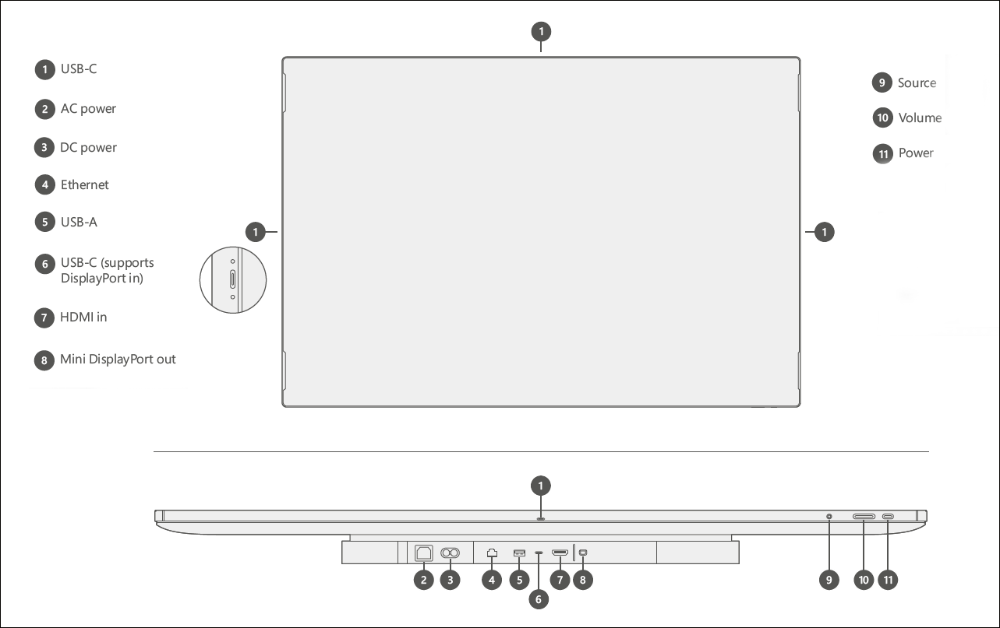

# Essential add-ons for Windows 10 Pro and Enterprise on Surface Hub 2

If you have migrated from Windows 10 Team to Windows 10 Pro or Enterprise on Surface Hub 2, you have the option of using Windows hello biometric authentication to sign into your device. You will need is certified Windows Hello camera to use face recognition. For fingerprint authentication, you will need the Surface Hub 2 Fingerprint Reader.

Windows 10 Pro and Enterprise for Surface Hub 2 can be used with a wide variety of accessories.
Surface Hub 2 supports various ports and standards:

- 1 x USB A port on compute module (behind display)
- 4 x USB C ports on bezels
- Bluetooth 4.1 support

 

For more information, see [Surface Hub 2S tech specs](/ep/redirect/external-link?url=https%3A%2F%2Fdocs.microsoft.com%2Fen-us%2Fsurface-hub%2Fsurface-hub-2s-techspecs&hmac=zXNA3y0U2JVdKSy1P%2FDVvuv2uJ7msoJ2L6SZdJQdq8Q%3D) 

## Surface Hub 2 Fingerprint Reader

if you’re running Windows 10 Pro or Windows 10 Enterprise on Surface Hub 2, you can sign in using the optional Surface Hub 2 Fingerprint Reader, a biometric authentication option that uses [Windows Hello](https://docs.microsoft.com/windows-hardware/design/device-experiences/windows-hello).

To use Surface Hub 2 Fingerprint Reader

1. Insert the fingerprint reader into any of the USB C bezel ports, located on each side of the device.
2. **Go to Start** > **Settings** > **Accounts** > **Sign-in options** > **Windows Hello Fingerprint** to enroll your fingerprint.

For more information about configuring the fingerprint reader to sign in using Windows Hello, see the following:

- [Learn about Windows Hello and set it up](https://support.microsoft.com/help/4028017/windows-learn-about-windows-hello-and-set-it-up)
- [Windows Hello biometrics in the enterprise](https://docs.microsoft.com/windows/security/identity-protection/hello-for-business/hello-biometrics-in-enterprise).

  
### Table 1. Surface Hub 2 Fingerprint Reader tech specs

| Component                       | Description                                                                                                                          |
| ------------------------------- | ------------------------------------------------------------------------------------------------------------------------------------ |
| **USB**                         | USB-C 2.0 full speed                                                                                                                 |
| **System requirement**          | Windows 10 Pro, Windows 10 Enterprise.                                                                                               |
| **Windows certification**       | Windows 10                                                                                                                           |
| **False Rejection Rate (FRR)**  | < 10%. FRR is the proportion of times a biometric system fails to grant access to authorized users.                                  |
| **False Acceptance Rate (FAR)** | 1/1.5 million. FAR shows the probability of a biometric security system to incorrectly accept access attempts by unauthorized users. |
| **Maximum fingerprints**        | > 300                                                                                                                                |
| **Maximum latency**             | <2s (with 300 FPs)                                                                                                                   |

> [!NOTE]
> Windows 10 Team, which runs on Surface Hub 2S does not support the Surface Hub 2 Fingerprint Reader. This is because Surface Hub 2S is designed to allow multiple users to interact with the device in a conference room environment. You now have the option of [migrating to Windows 10 Pro or Windows 10 Enterprise](https://docs.microsoft.com/surface-hub/surface-hub-2s-migrate-os), which lets you use Surface Hub 2S much like any other computer.
 

## Audio and video accessories

You can extend the audio and video capabilities of Surface Hub 2 with audio and camera peripherals using the USB-C or USB-A ports.

For information about recommended accesories, see:

- [USB audio and video devices certified for Microsoft Teams](https://docs.microsoft.com/microsoftteams/devices/usb-devices)
- [IP Phones certified for Microsoft Teams](https://docs.microsoft.com/microsoftteams/devices/teams-ip-phones)

## **Windows Hello face recognition**

Windows 10 Pro and Enterprise on Surface Hub 2 supports Windows Hello for authentication and requires a Windows Hello certified camera accessory. Note that the built-in camera for Surface Hub 2S is not designed for authentication and does not support Windows Hello. For more information, see [Windows Hello.](https://docs.microsoft.com/windows-hardware/design/device-experiences/windows-hello)

