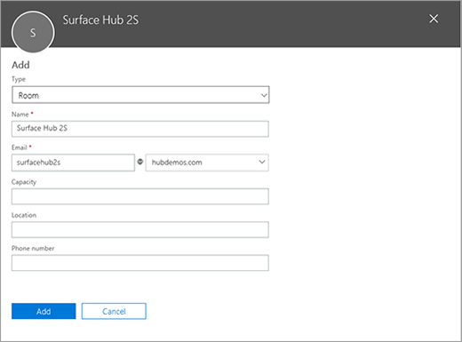
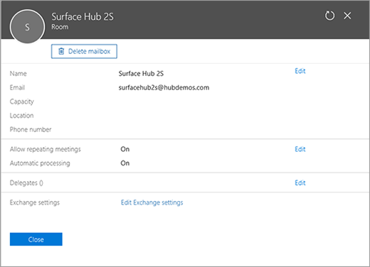
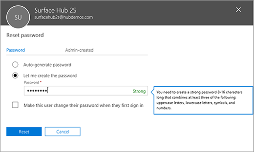

# Create Surface Hub 2S device account

Creating a Surface Hub device account (also known as a Room mailbox) allows Surface Hub 2S to receive, approve, or decline meeting requests and join meetings. Configure the device account during Out-of-Box Experience (OOBE) setup. If needed, you can change it later (without going through OOBE setup).

## Create account using Microsoft 365 Admin center

To meet minimum requirements, you can configure everything you need for the account directly from the [Microsoft 365 admin center](https://admin.microsoft.com/AdminPortal). Some features like sharing whiteboards directly from the whiteboard app require using PowerShell to configure ActiveSync; see [Enable ActiveSync if use of email app is required] (enable-activesync-if-use-of-email-app-is-required) on this page.

## Create account using PowerShell

You can use PowerShell scripts to facilitate creation of multiple device accounts and quickly configure specific features including:

- Calendar processing for every Surface Hub device account.
- Custom auto replies to scheduling requests.
- If the default ActiveSync mailbox policy has already been modified by someone else or by another process, you will likely have to create and assign a new ActiveSync mailbox policy.

> [!NOTE]  
> The Surface Hub device account doesn’t support third-party Federated Identity Providers (FIPs) and must be a standard Active Directory or Azure Active Directory account.

## Configure with admin center

1. In the Microsoft 365 admin center, go to **Resources** and choose **Rooms & Equipment** and then select **+ Add resource**.

2. Provide a name and email address for the device account. Leave remaining settings unchanged in the default state.

   

   

3. Set the password for the device account. To set the password, choose **Users** and then select **Active Users**. Now search for the newly created user to set the password. Ensure that you **do not** select the option **Make this user change their password when they first sign in.**

   

4. Assign the room with an Office 365 license. It’s recommended to assign the Office 365 **Meeting Room** license, which automatically enables the account for Microsoft Teams and Skype for Business.

   


> [!NOTE]  
> If using Skype for Business, you will need to finalize setup via PowerShell -- Skype for Business Calendar: Set [Calendar Autoprocessing](#set-calendar-auto-processing-skype-for-business-only) for this account. 

## Configure with PowerShell

Windows PowerShell is widely used by system administrators and power-users  across multiple devices. Using PowerShell to rapidly automate tasks on Surface Hub does not neccessarily require PowerShell expertise. Ensure you have completed the setup prerequisites before using the appropriate scripts on this page.

### Prerequisites for using PowerShell to manage Surface Hub 

1. Launch PowerShell with elevated account privileges (**Run as Administrator**) and ensure your system is configured to run PowerShell scripts. To learn more, refer to [About Execution Policies](https://docs.microsoft.com/powershell/module/microsoft.powershell.core/about/about_execution_policies?). 
2. [Install Azure PowerShell module](https://docs.microsoft.com/powershell/azure/install-az-ps).


### Connect to Exchange Online PowerShell

```powershell
Install-Module -Name ExchangeOnlineManagement
Import-Module ExchangeOnlineManagement
Connect-ExchangeOnline -UserPrincipalName admin@contoso.com -ShowProgress $true
```

### Create mailbox

```powershell
New-Mailbox -MicrosoftOnlineServicesID 'SurfaceHub01@contoso.com' -Alias SurfaceHub01 -Name "Surface Hub 01" -Room -EnableRoomMailboxAccount $true -RoomMailboxPassword (ConvertTo-SecureString -String 'Pass@word1' -AsPlainText -Force)
```

### Set Calendar auto-processing (Skype for Business only)

```powershell
Set-CalendarProcessing -Identity 'SurfaceHub01@contoso.com' -AutomateProcessing AutoAccept -AddOrganizerToSubject $false -AllowConflicts $false -DeleteComments $false -DeleteSubject $false -RemovePrivateProperty $false
Set-CalendarProcessing -Identity 'SurfaceHub01@contoso.com' -AddAdditionalResponse $true -AdditionalResponse "This is a Microsoft Surface Hub. Please make sure this meeting is a Microsoft Teams meeting!"
```

### Enable ActiveSync if use of email app is required

 The default ActiveSync Policy will work if unchanged. Otherwise create a new Policy and assign.

```powershell
New-MobileDeviceMailboxPolicy -Name:"SurfaceHub" -PasswordEnabled:$false
#Assign Policy to Hub:
Set-CASMailbox -Identity SurfaceHub01@contoso.com -ActiveSyncMailboxPolicy "SurfaceHub"
```

### Connect to Azure AD

```powershell
Connect-AzureAD
```

### Assign a license

```powershell
Set-AzureADUser -ObjectId 'SurfaceHub01@contoso.com' -UsageLocation US
$License = New-Object -TypeName Microsoft.Open.AzureAD.Model.AssignedLicense 
$License.SkuId = "c7df2760-2c81-4ef7-b578-5b5392b571df" 
$Licenses = New-Object -TypeName Microsoft.Open.AzureAD.Model.AssignedLicenses 
$Licenses.AddLicenses = $License 
Set-AzureADUserLicense -ObjectId 'SurfaceHub01@contoso.com' -AssignedLicenses $Licenses
```

### Check for available licenses

```powershell
Get-AzureADUser -Filter "userPrincipalName eq 'SurfaceHub01@contoso.com'" |fl *
#Meeting Room Standard SKU:
6070a4c8-34c6-4937-8dfb-39bbc6397a60
```

## Account verification script

After creating the device account, you can run the following verification script. This script validates a previously-created device account and produces a summary report. For example:

``` syntax
15 tests executed
0 failures
2 warnings
15 passed
```

Details of specific settings will not be shown.

```PowerShell
# SHAccountValidate.ps1

$Error.Clear()
$ErrorActionPreference = "Stop"


# Cleans up set state such as remote powershell sessions
function Cleanup()
{
    if ($sessEx)
    {
        Remove-PSSession $sessEx
    }
    if ($sessSfb)
    {
        Remove-PSSession $sessSfb
    }
}

function PrintError($strMsg)
{
    Write-Host $strMsg -foregroundcolor "red"
}

function PrintSuccess($strMsg)
{
    Write-Host $strMsg -foregroundcolor "green"
}

function PrintAction($strMsg)
{
    Write-Host $strMsg -ForegroundColor Cyan
}


# Cleans up and prints an error message
function CleanupAndFail($strMsg)
{
    if ($strMsg)
    {
        PrintError($strMsg);
    }
    Cleanup
    exit 1
}

# Exits if there is an error set and prints the given message
function ExitIfError($strMsg)
{
    if ($Error)
    {
        CleanupAndFail($strMsg);
    }
}

$strUpn = Read-Host "What is the email address of the account you wish to validate?"
if (!$strUpn.Contains('@'))
{
    CleanupAndFail "$strUpn is not a valid email address"
}
$strExServer = Read-Host "What is your exchange server? (leave blank for online tenants)"
if ($strExServer.Equals(""))
{
    $fExIsOnline = $true
}
else
{
    $fExIsOnline = $false
}
$credEx = Get-Credential -Message "Please provide exchange user credentials"

$strRegistrarPool = Read-Host ("What is the Skype for Business registrar pool for $strUpn" + "? (leave blank for online tenants)")
$fSfbIsOnline = $strRegistrarPool.Equals("")

$fHasOnPrem = $true
if ($fSfbIsOnline -and $fExIsOnline)
{
    do
    {
        $strHasOnPrem = (Read-Host "Do you have an on-premises Active Directory (Y/N) (No if your domain services are hosted entirely online)").ToUpper()
    } while ($strHasOnPrem -ne "Y" -and $strHasOnPrem -ne "N")
    $fHasOnPrem = $strHasOnPrem.Equals("Y")
}

$fHasOnline = $false
if ($fSfbIsOnline -or $fExIsOnline)
{
    $fHasOnline = $true
}

if ($fSfbIsOnline)
{
    try {
        Import-Module SkypeOnlineConnector
    }
    catch
    {
        CleanupAndFail "To verify Skype for Business in online tenants you need the Lync Online Connector module from https://www.microsoft.com/download/details.aspx?id=39366"
    }
}
else
{
    $credSfb = (Get-Credential -Message "Please enter Skype for Business admin credentials")
}

if ($fHasOnline)
{
    $credSfb = $credEx
    try {
        Import-Module MSOnline
    }
    catch
    {
        CleanupAndFail "To verify accounts in online tenants you need the Azure Active Directory module for PowerShell from https://go.microsoft.com/fwlink/p/?linkid=236297"
    }
}

PrintAction "Connecting to Exchange Powershell Session..."
[System.Management.Automation.Runspaces.AuthenticationMechanism] $authType = [System.Management.Automation.Runspaces.AuthenticationMechanism]::Kerberos
if ($fExIsOnline)
{
    $authType = [System.Management.Automation.Runspaces.AuthenticationMechanism]::Basic
}
try
{
    $sessEx = $null
    if ($fExIsOnline)
    {
        $sessEx = New-PSSession -ConfigurationName microsoft.exchange -Credential $credEx -AllowRedirection -Authentication $authType -ConnectionUri "https://outlook.office365.com/powershell-liveid/" -WarningAction SilentlyContinue
    }
    else
    {
        $sessEx = New-PSSession -ConfigurationName microsoft.exchange -Credential $credEx -AllowRedirection -Authentication $authType -ConnectionUri https://$strExServer/powershell -WarningAction SilentlyContinue
    }
}
catch
{
}

if (!$sessEx)
{
    CleanupAndFail "Connecting to Exchange Powershell failed, please validate your server is accessible and credentials are correct"
}

PrintSuccess "Connected to Exchange Powershell Session"

PrintAction "Connecting to Skype for Business Powershell Session..."

if ($fSfbIsOnline)
{
    $sessSfb = New-CsOnlineSession -Credential $credSfb
}
else
{
    $sessSfb = New-PSSession -Credential $credSfb -ConnectionURI "https://$strRegistrarPool/OcsPowershell" -AllowRedirection -WarningAction SilentlyContinue
}

if (!$sessSfb)
{
    CleanupAndFail "Connecting to Skype for Business Powershell failed, please validate your server is accessible and credentials are correct"
}

PrintSuccess "Connected to Skype for Business Powershell"

if ($fHasOnline)
{
    $credMsol = $null
    if ($fExIsOnline)
    {
        $credMsol = $credEx
    }
    elseif ($fSfbIsOnline)
    {
        $credMsol = $credSfb
    }
    else
    {
        CleanupAndFail "Internal error - could not determine MS Online credentials"
    }
    try
    {
        PrintAction "Connecting to Azure Active Directory Services..."
        Connect-MsolService -Credential $credMsol
        PrintSuccess "Connected to Azure Active Directory Services"
    }
    catch
    {
        # This really shouldn't happen unless there is a network error
        CleanupAndFail "Failed to connect to MSOnline"
    }
}


PrintAction "Importing remote sessions into the local session..."
try
{
    $importEx = Import-PSSession $sessEx -AllowClobber -WarningAction SilentlyContinue -DisableNameChecking
    $importSfb = Import-PSSession $sessSfb -AllowClobber -WarningAction SilentlyContinue -DisableNameChecking
}
catch
{
}
if (!$importEx -or !$importSfb)
{
    CleanupAndFail "Import failed"
}
PrintSuccess "Import successful"


$mailbox = $null
try
{
    $mailbox = Get-Mailbox -Identity $strUpn
}
catch
{
}

if (!$mailbox)
{
    CleanupAndFail "Account exists check failed. Unable to find the mailbox for $strUpn - please make sure the Exchange account exists on $strExServer"
}

$exchange = $null
if (!$fExIsOnline)
{
    $exchange = Get-ExchangeServer
    if (!$exchange -or !$exchange.IsE14OrLater)
    {
        CleanupAndFail "A compatible exchange server version was not found. Please use at least exchange 2010."
    }
}


$strAlias = $mailbox.UserPrincipalName
$strDisplayName = $mailbox.DisplayName

$strLinkedAccount = $strLinkedDomain = $strLinkedUser = $strLinkedServer = $null
$credLinkedDomain = $Null
if (!$fExIsOnline -and ![System.String]::IsNullOrEmpty($mailbox.LinkedMasterAccount) -and !$mailbox.LinkedMasterAccount.EndsWith("\SELF"))
{
    $strLinkedAccount = $mailbox.LinkedMasterAccount
    $strLinkedDomain = $strLinkedAccount.substring(0,$strLinkedAccount.IndexOf('\'))
    $strLinkedUser = $strLinkedAccount.substring($strLinkedAccount.IndexOf('\') + 1)
    $strLinkedServer = Read-Host "What is the domain controller for the $strLinkedDomain"
    $credLinkedDomain = (Get-Credential -Message "Please provide credentials for $strLinkedDomain")
}


Write-Host
Write-Host
Write-Host
PrintAction "Performing verification checks on $strDisplayName..."
$Global:iTotalFailures = 0
$global:iTotalWarnings = 0
$Global:iTotalPasses = 0

function Validate()
{
    Param(
        [string]$Test,
        [bool]  $Condition,
        [string]$FailureMsg,
        [switch]$WarningOnly
    )

    Write-Host -NoNewline -ForegroundColor White $Test.PadRight(100,'.')
    if ($Condition)
    {
        Write-Host -ForegroundColor Green "Passed"
        $global:iTotalPasses++
    }
    else
    {
        if ($WarningOnly)
        {
            Write-Host -ForegroundColor Yellow ("Warning: "+$FailureMsg)
            $global:iTotalWarnings++
        }
        else
        {
            Write-Host -ForegroundColor Red ("Failed: "+$FailureMsg)
            $global:iTotalFailures++
        }
    }
}
```