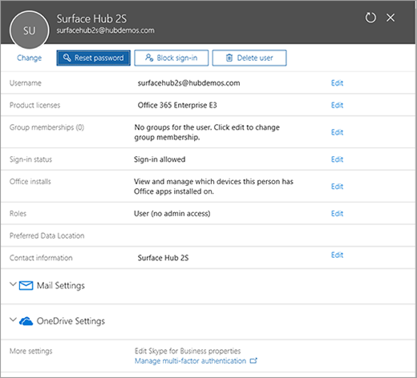

# Create Surface Hub 2S device account

Creating a Surface Hub device account (also known as a Room mailbox) allows Surface Hub 2S to receive, approve, or decline meeting requests and join meetings using either Microsoft Teams or Skype for Business. Configure the device account during Out-of-Box Experience (OOBE) setup. If needed, you can change it later (without going through OOBE setup).

Unlike standard Room mailboxes that remain disabled by default, you need to enable the Surface Hub 2S device account to sign on to Microsoft Teams and Skype for Business. Surface Hub 2S relies on Exchange ActiveSync, which requires an ActiveSync mailbox policy on the device account. Apply the default ActiveSync mailbox policy that comes with Exchange Online.

Create the account by using the Microsoft 365 admin center or by using PowerShell. You can use Exchange Online PowerShell to configure specific features including:

- Calendar processing for every Surface Hub device account.
- Custom auto replies to scheduling requests.
- If the default ActiveSync mailbox policy has already been modified by someone else or by another process, you will likely have to create and assign a new ActiveSync mailbox policy.

> [!NOTE]  
> The Surface Hub device account doesn’t support third-party Federated Identity Providers (FIPs) and must be a standard Active Directory or Azure Active Directory account.

## Create account using Microsoft 365 admin center

1. In the Microsoft 365 admin center, go to **Resources** and choose **Rooms & Equipment** and then select **+ Room**.

2. Provide a name and email address for the device account. Leave remaining settings unchanged in the default state.

   

   

3. Set the password for the device account. To set the password, choose **Users** and then select **Active Users**. Now search for the newly created user to set the password. Ensure that you **do not** select the option **Make this user change their password when they first sign in.**

   

4. Assign the room with an Office 365 license. It’s recommended to assign the Office 365 **Meeting Room** license, a new option that automatically enables the account for Skype for Business Online and Microsoft Teams.

   

### Finalize setup via PowerShell

- **Microsoft Teams and Skype for Business Calendar:** Set [**Calendar Auto processing**](https://docs.microsoft.com/surface-hub/surface-hub-2s-account?source=docs#set-calendar-auto-processing) for this account.

## Create account using PowerShell

Instead of using the Microsoft Admin Center portal, you can create the account using PowerShell.

### Connect to Exchange Online PowerShell

```powershell
Install-Module -Name ExchangeOnlineManagement
Import-Module ExchangeOnlineManagement
Connect-ExchangeOnline -UserPrincipalName admin@contoso.com -ShowProgress $true
```

### Create mailbox

```powershell
New-Mailbox -MicrosoftOnlineServicesID 'SurfaceHub01@contoso.com' -Alias SurfaceHub01 -Name "Surface Hub 01" -Room -EnableRoomMailboxAccount $true -RoomMailboxPassword (ConvertTo-SecureString -String 'Pass@word1' -AsPlainText -Force)
```

### Set Calendar auto-processing

```powershell
Set-CalendarProcessing -Identity 'SurfaceHub01@contoso.com' -AutomateProcessing AutoAccept -AddOrganizerToSubject $false -AllowConflicts $false -DeleteComments $false -DeleteSubject $false -RemovePrivateProperty $false
Set-CalendarProcessing -Identity 'SurfaceHub01@contoso.com' -AddAdditionalResponse $true -AdditionalResponse "This is a Microsoft Surface Hub. Please make sure this meeting is a Microsoft Teams meeting!"
```

### Enable ActiveSync if use of email app is required

 The default ActiveSync Policy will work if unchnaged. Otherwise create a new Policy and assign.

```powershell
New-MobileDeviceMailboxPolicy -Name:"SurfaceHub" -PasswordEnabled:$false
#Assign Policy to Hub:
Set-CASMailbox -Identity SurfaceHub01@contoso.com -ActiveSyncMailboxPolicy "SurfaceHub"
```
### Connect to Azure AD

```powershell
Connect-AzureAD
```

### Assign a license

```powershell
Set-AzureADUser -ObjectId 'SurfaceHub01@contoso.com' -UsageLocation US
$License = New-Object -TypeName Microsoft.Open.AzureAD.Model.AssignedLicense 
$License.SkuId = "c7df2760-2c81-4ef7-b578-5b5392b571df" 
$Licenses = New-Object -TypeName Microsoft.Open.AzureAD.Model.AssignedLicenses 
$Licenses.AddLicenses = $License 
Set-AzureADUserLicense -ObjectId 'SurfaceHub01@contoso.com' -AssignedLicenses $Licenses
```

### Check for available licenses

```powershell
Get-AzureADUser -Filter "userPrincipalName eq 'SurfaceHub01@contoso.com'" |fl *
#Meeting Room Standard SKU:
6070a4c8-34c6-4937-8dfb-39bbc6397a60
```