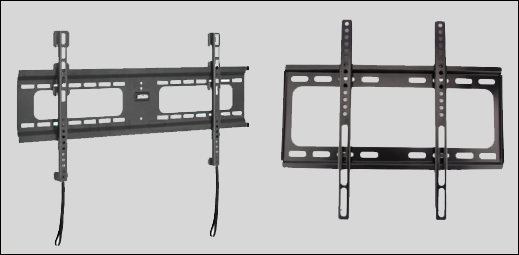

# Customize wall mount of Surface Hub 2S 50"

This article provides guidance for physically installing the Microsoft Surface Hub 2S 50." For information about installing the 85" see [Install and mount Surface Hub 2S 85"](surface-hub-2s-85-install-mount.md).

If not using certified mounting solutions, you can mount Surface Hub 2S 50" using readily available retail hardware.

## Set wall mount measurements

Surface Hub 2S 50" recommended mounting measurements:

|**Item**|**Description**|**Notes**|
|:------ |:------------- |:------- |
|**Height from bottom of Surface Hub 2S 50"**| 1026.5 mm (40.41”) | Recommended |
|**Height from top of Surface Hub 2S 50"**| 1767.2 mm (69.57”) | Recommended |
|**Height from center of mount**| 1397 mm (55”) | Recommended |

1. Measure 1026.5 mm (40.41”) from the floor level to set the recommended minimum height.
2. Measure 1767.2 mm (69.57”) from the floor level to set the recommended top height.

  

3. Measure 1397 mm (55”) mm from the floor level to set the recommended center height.

  

## Obstruction free mounting

In addition to the visible ports on the sides of the device, certain integrated components must remain free of obstruction in order to function correctly. These include the Bluetooth, Wi-Fi, occupancy, and mic sensors as well thermal cooling vents.
 Keep out zones

|**Item**|**Description**|**Notes**|
|:---- |:----------- |:----- |
|**Access**| Ensure unimpeded access to input/output ports, the compute cartridge, Bluetooth radio, Bluetooth sensor, Wi-Fi radio, Wi-Fi sensor, occupancy sensor. | See Figure 1. |
|**Air flow**| Avoid blocking inlet and outlet air vent zones. | See Figure 2  |
|**Audio**| Avoid blocking audio exit zone on rear of Surface Hub 2S 50". | See Figure 2. |

  
***Figure 1. Keep out zones for Surface Hub 2S 50" components***

  
***Figure 2. Avoid blocking thermal inlet/outlet and audio exit zones. ***

The removable compute cartridge containing the I/O ports must remain free of any obstructions or impediments of any kind.

  
***Figure 3.View of compute cartridge on the underside of Surface Hub 2S 50".***

  
***Figure 4. Unimpeded removal of compute cartridge***

## Selecting a mounting system

Surface Hub 2S 50" uses a 350 mm x 350 mm mounting framework that meets most — but not all — of the criteria listed in the VESA Flat Display Mounting Interface Standard. You can install Surface Hub 2S 50" using any of various off-the-shelf display brackets designed to accommodate displays that diverge from exact VESA specifications, as shown below.

On the back of Surface Hub 2S 50", you’ll find a square pattern of four M6 x 1.0 threaded holes centered on the circular bump (565 mm in diameter). Attach your mount using four M6 x 1.0–12 mm-long metric bolts. Or, depending on preference, you can use longer bolts up to a maximum of 20 mm.
Important considerations for mounting systems

|**Item**|**Description**|**Notes**|
|:------ |:------------- |:------- |
|**Strength**| Only choose mounts that can safely support devices of at least 28 kg (62 lbs.). | Required |
|**Stiffness**| Avoid flexible display mounts that can diminish the interactive pen and touch use experience. Most TV mounts are not designed to support touch displays. | Recommended |
|**Depth**| Keep the device mounted tightly to the wall especially in corridors and along circulation paths within rooms.| Recommended |
|**Versatility**| Ensure your mounting solution remains hidden from view in both the existing landscape mode and any  potential portrait mode (subject to future availability). | Recommended |

  
***Figure 5. Surface Hub 2S 50" mounting configuration***

## Mounting methods compatible with Surface Hub 2S 50"

Surface Hub 2S 50" is compatible with mounts that allow you to place it at angles of 10-70 degrees from the vertical plane. Rail mounts typically have multiple holes and a set of slots, enabling compatibility across a wide range of displays. A rail attached to the wall and two mounts attached to the display enable you to securely install Surface Hub 2S 50" to a wall. When evaluating rail mounts for compatibility, ensure they meet versatility requirements listed earlier.

 
***Figure 6. Surface Hub 2S 50" rail mounts***
