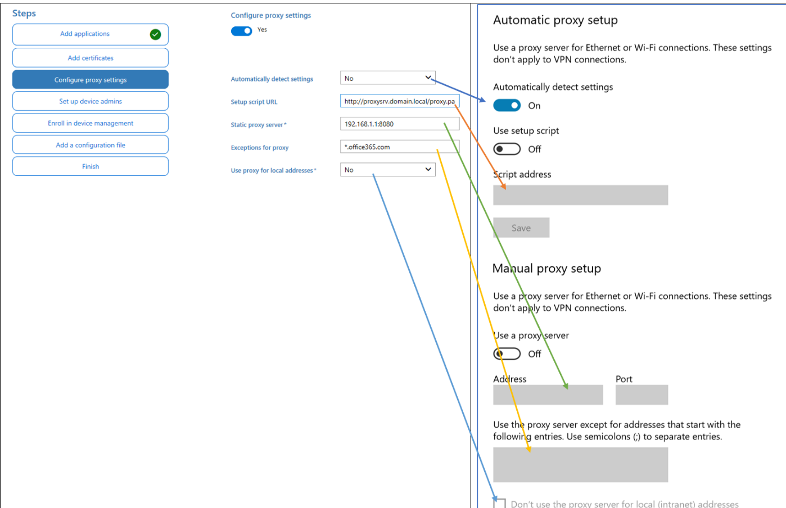
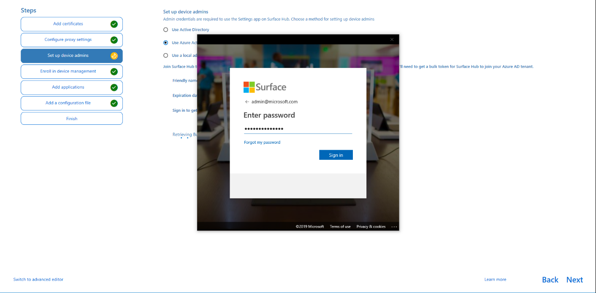

# Create provisioning packages for Surface Hub 2S

You can use Windows Configuration Designer (WCD) to create provisioning packages to automate deployment of Surface Hub 2S. Use provisioning packages to add certificates, configure proxies, set up device administrators and device accounts. You can also use provisioning packages along with a configuration file to deploy multiple Surface Hubs with a single USB thumb drive.

### Install Windows Configuration Designer

Install Windows Configuration Designer from the Windows Assessment and Deployment Kit (ADK) for Windows 10. Download and install the [ADK for Windows 10, version 1703](https://go.microsoft.com/fwlink/p/?LinkId=845542). For more information, see [Download and install the Windows ADK](https://docs.microsoft.com/windows-hardware/get-started/adk-install).

### Add certificates

You can import Certificate Authority certificates to Surface Hub 2S.
To add certificates to Surface Hub 2S, you need a copy of each certificate as X.509 in .cer format. You cannot import .crt, .pfx or other container formats. Certificates must be imported into Windows Configuration Designer and arranged by hierarchy:

> [!div class="mx-imgBorder"]
> 

### Configure proxy during OOBE

In Windows Configuration Designer, go to the Configure proxy settings tab and enter the appropriate settings as shown below.

> [!div class="mx-imgBorder"]
>  

> [!NOTE]
> When configuring proxy settings, turn off **Automatically detect settings** if you intend to use a setup script or a proxy server. You can use a setup script *or* a proxy server, not both.

### Affiliate Surface Hub 2S with Azure Active Directory

You can affiliate Surface Hub 2S with Azure Active Directory using a provisioning package:
As an Azure Active Directory Global Administrator, you can join large numbers of new Windows devices to Azure Active Directory and Intune using a bulk token.

To create a bulk token, give it a friendly name, configure the expiration date (maximum of 30 days) and use your Admin credentials to acquire the token as shown below:

> [!div class="mx-imgBorder"]
> 

> [!div class="mx-imgBorder"]
> 

> [!div class="mx-imgBorder"]
> 

### Provisioning multiple devices (.csv file)

In addition to the provisioning package, you can use a Surface Hub configuration file to make it even easier to set up your devices. A Surface Hub configuration file contains a list of device accounts and friendly names for wireless projection. During first run, you get an option to choose a device account and friendly name from a configuration file.

### To create a Surface Hub configuration file

1. Using Microsoft Excel or another CSV editor, create a CSV file named: **SurfaceHubConfiguration.csv**

2. Enter a list of device accounts and friendly names in this format:

    `<DeviceAccountName>,<DeviceAccountPassword>,<FriendlyName>`

3. Save the file to the root of the USB thumb drive where you copied the PPKG file.

    > [!div class="mx-imgBorder"]
    > 
