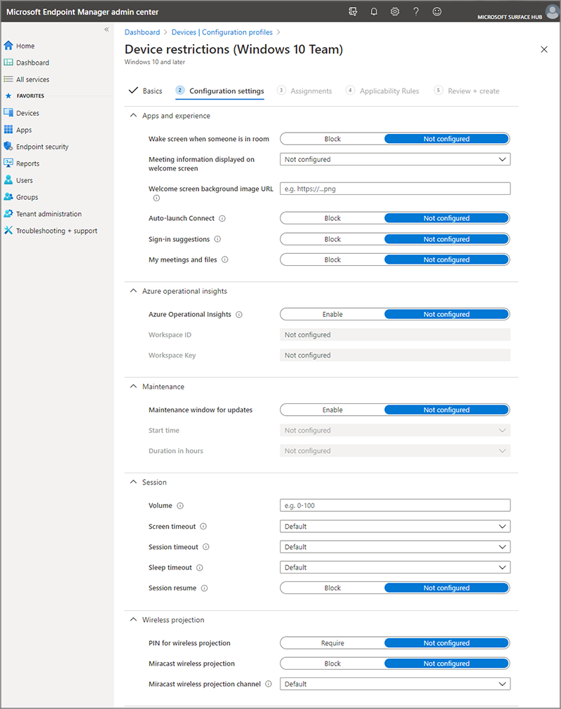

# Manage Surface Hub 2S with Intune

## Register Surface Hub 2S with Intune

Surface Hub 2S allows IT administrators to manage settings and policies using a mobile device management (MDM) provider. Surface Hub 2S has a built-in management component to communicate with the management server, so there is no need to install additional clients on the device.

### Manual registration

1. Open the **Settings** app on the Surface Hub 2S and sign in as a local administrator. Select **Surface Hub** > **Device management** and then select **+** to add.
2. You will be prompted to login with the account to use for Intune. After authenticating, the device will automatically register with Intune.

    
   
> [!NOTE]
> The account used for authentication will be the Intune enrollment account, and must be licensed for Intune.

### Auto registration — Azure Active Directory Affiliated

During the initial setup process, when affiliating a Surface Hub with an Azure AD tenant that has Intune auto enrollment enabled, the device will automatically enroll with Intune. For more information, refer to [Intune enrollment methods for Windows devices](https://docs.microsoft.com/intune/enrollment/windows-enrollment-methods). Azure AD affiliation and Intune auto enrollment is required for the Surface Hub to be a "compliant device" in Intune. 

## Managing Windows 10 Team settings with Intune

1. Sign into **Microsoft Endpoint Manager**, select **Devices** > **Configuration profiles** > **Create profile**. 
2. Under **Platform**, select **Windows 10 and later** > **Device restrictions (Windows 10 Team)** and then select **Create**. 
3. You can now browse and select preset device restriction settings for Surface Hub and Surface Hub 2S.

   

These settings span the following categories: Apps and experience, Azure operational insights, Maintenance, Session, and Wireless projection.  

## Supported Configuration service providers (CSPs)

In addition to the policies available directly via the Intune console, there are numerous Configuration service providers (CSPs) that map to registry keys or files. 

Microsoft typically provides new CSPs with each new versions of the Windows 10 operating system. The [Windows 10 Team 2020 Update](surface-hub-install-2020preview.md), available in preview via the Windows Insider Program, includes more than 20 new and updated device management policies for Surface Hub and Surface Hub 2S. These MDM policies give IT admins improved control over app updates from the Microsoft Store, wireless projection settings such as Miracast over infrastructure, network settings such as Quality-Of-Service and 802.1x wired authentication, and new privacy/GDPR related settings.

For more information, see the following resources: 

- [Configuration service provider reference](https://docs.microsoft.com/windows/client-management/mdm/configuration-service-provider-reference) 
- [SurfaceHub CSP](https://docs.microsoft.com/windows/client-management/mdm/surfacehub-csp)
- [Policy CSPs supported by Microsoft Surface Hub](https://docs.microsoft.com/windows/client-management/mdm/policy-csps-supported-by-surface-hub)

## Quality of Service (QoS) settings

To ensure optimal video and audio quality on Surface Hub 2S, add the following QoS settings to the device. 

### Microsoft Teams QoS settings 

| Name | Description | OMA-URI | Type | Value |
|:------ |:------------- |:--------- |:------ |:------- |
|**Audio Ports**| Audio Port range | ./Device/Vendor/MSFT/NetworkQoSPolicy/TeamsAudio/DestinationPortMatchCondition | String  | 3478-3479 |
|**Audio DSCP**| Audio ports marking | ./Device/Vendor/MSFT/NetworkQoSPolicy/TeamsAudio/DSCPAction | Integer | 46 |
|**Video Port**| Video Port range | ./Device/Vendor/MSFT/NetworkQoSPolicy/TeamsVideo/DestinationPortMatchCondition | String  | 3480 |
|**Video DSCP**| Video ports marking | ./Device/Vendor/MSFT/NetworkQoSPolicy/TeamsVideo/DSCPAction | Integer | 34 |
|**P2P Audio Ports**| Audio Port range | ./Device/Vendor/MSFT/NetworkQoSPolicy/TeamsP2PAudio/DestinationPortMatchCondition | String  | 50000-50019 |
|**P2P Audio DSCP**| Audio ports marking | ./Device/Vendor/MSFT/NetworkQoSPolicy/TeamsP2PAudio/DSCPAction | Integer | 46 |
|**P2P Video Ports**| Video Port range | ./Device/Vendor/MSFT/NetworkQoSPolicy/TeamsP2PVideo/DestinationPortMatchCondition | String  | 50020-50039 |
|**P2P Video DSCP**| Video ports marking | ./Device/Vendor/MSFT/NetworkQoSPolicy/TeamsP2PVideo/DSCPAction | Integer | 34 |

### Skype for Business QoS settings

| Name               | Description         | OMA-URI                                                                  | Type    | Value                          |
| ------------------ | ------------------- | ------------------------------------------------------------------------ | ------- | ------------------------------ |
| Audio Ports        | Audio Port range    | ./Device/Vendor/MSFT/NetworkQoSPolicy/SfBAudio/SourcePortMatchCondition  | String  | 50000-50019                    |
| Audio DSCP         | Audio ports marking | ./Device/Vendor/MSFT/NetworkQoSPolicy/SfBAudio/DSCPAction                | Integer | 46                             |
| Audio Media Source | Skype App name      | ./Device/Vendor/MSFT/NetworkQoSPolicy/SfBAudio/AppPathNameMatchCondition | String  | Microsoft.PPISkype.Windows.exe |
| Video Ports        | Video Port range    | ./Device/Vendor/MSFT/NetworkQoSPolicy/SfBVideo/SourcePortMatchCondition  | String  | 50020-50039                    |
| Video DSCP         | Video ports marking | ./Device/Vendor/MSFT/NetworkQoSPolicy/SfBVideo/DSCPAction                | Integer | 34                             |
| Video Media Source | Skype App name      | ./Device/Vendor/MSFT/NetworkQoSPolicy/SfBVideo/AppPathNameMatchCondition | String  | Microsoft.PPISkype.Windows.exe |

> [!NOTE]
> Both tables show default port ranges. Administrators may change the port ranges in the Skype for Business and Teams control panel.

## Microsoft Teams settings

You can configure various Microsoft Teams settings using Intune.

### Modes

Surface Hub 2S comes installed with Microsoft Teams in mode 0, which supports both Microsoft Teams and Skype for Business. The modes function as described below:

- Mode 0 — Skype for Business with Microsoft Teams functionality for scheduled meetings.
- Mode 1 — Microsoft Teams with Skype for Business functionality for scheduled meetings.
- Mode 2 — Microsoft Teams only.

To adjust the mode, add the following settings to a [custom device configuration profile](https://docs.microsoft.com/mem/intune/configuration/custom-settings-configure).

| Name | Description | OMA-URI | Type | Value |
|:--- |:--- |:--- |:--- |:--- |
|**Teams App ID**|App name|./Vendor/MSFT/SurfaceHub/Properties/VtcAppPackageId|String| Microsoft.MicrosoftTeamsforSurfaceHub_8wekyb3d8bbwe!Teams|
|**Teams App Mode**|Teams mode|./Vendor/MSFT/SurfaceHub/Properties/SurfaceHubMeetingMode|Integer| 0 or 1 or 2|

### Coordinated Meetings and proximity join

Teams Coordinated Meeting and proximity join features can be [configured through an XML file](https://docs.microsoft.com/mem/intune/configuration/custom-settings-configure) deployed via an Intune profile.
