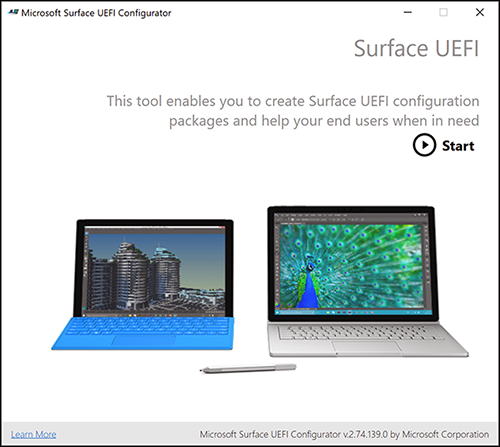
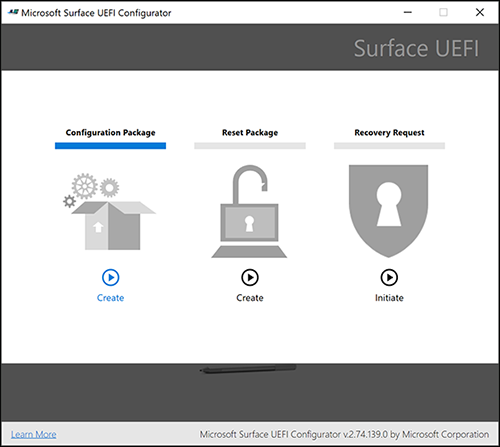
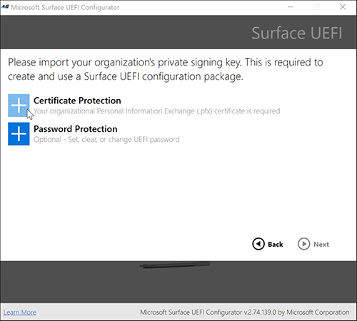
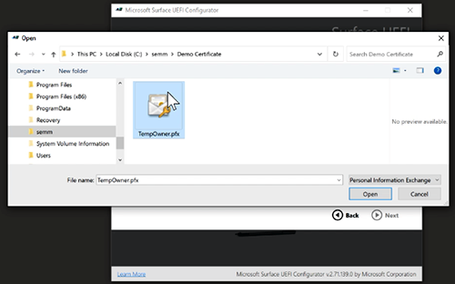
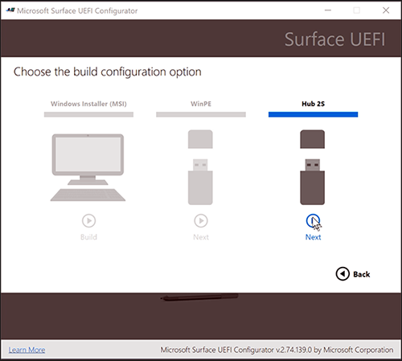
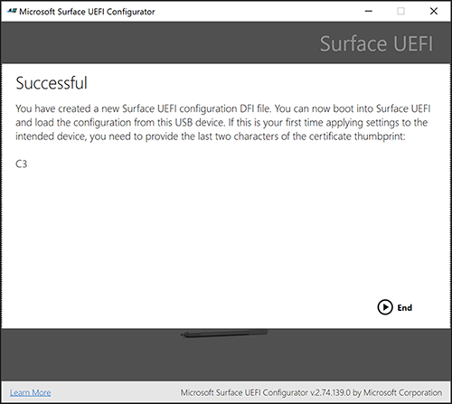
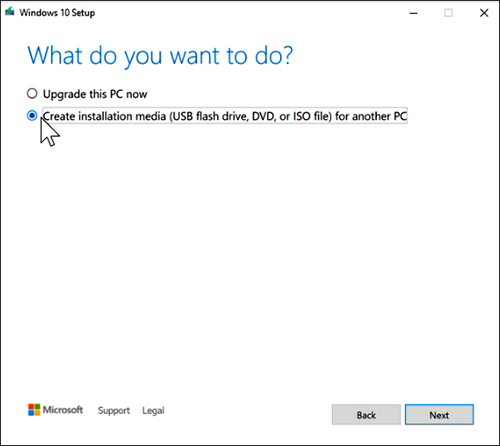
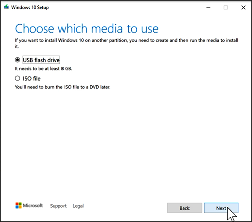

# Migrate to Windows 10 Pro or Enterprise on Surface Hub 2

## Introduction

Surface Hub 2S comes pre-installed with Windows 10 Team, a customized edition of Windows 10 designed to facilitate easy collaboration in meeting room environments. Now you have the option of running Windows 10 Pro or Enterprise to use Surface Hub 2S much like any other PC. 

> [!IMPORTANT]
>Unlike a typical upgrade or migration, this process requires you to follow a prescriptive procedure, as described on this page. Review the [Solution components](#solution-components) and [Migration workflow](#migration-workflow-summary) before proceeding.

You start the migration from Windows 10 Team using a separate PC and downloadable tool -- **Surface UEFI Configurator** --  to create a package containing a new UEFI setting that you apply to Surface Hub 2S.  Surface UEFI Configurator functions as an interface into Surface Enterprise Management Mode (SEMM), designed to facilitate centralized management of firmware settings on Surface devices in a corporate environment. To learn more about SEMM, see [Microsoft Surface Enterprise Management Mode documentation](https://docs.microsoft.com/surface/surface-enterprise-management-mode).
 

## Solution Components

- Surface Hub 2S device running Windows 10 Team operating system
- Separate device running Windows 10
- Surface UEFI Configurator tool
- Windows 10 Pro or Enterprise OS image, version 1903 or greater
- Two USB drives with 16GB of storage, FAT32 format
- Drivers and Firmware for Windows 10 Pro and Enterprise on Surface Hub 2, Windows Installer .MSI file
- Internet connection
- Imaging solution (optional)

 
## Migration workflow summary

| Step  | Action                                                                                                 | Summary                                                                                                                                                                                                                                                                                                                                                                                                  |
| - | ------------------------------------------------------------------------------------------------------ | -------------------------------------------------------------------------------------------------------------------------------------------------------------------------------------------------------------------------------------------------------------------------------------------------------------------------------------------------------------------------------------------------------- |
| 1 | [Verify UEFI version on Surface Hub 2S meets minimum requirements](#verify-uefi-version-on-surface-hub-2s-meets-minimum-requirements)                                  | Ensure the UEFI version is 694.2938.768.0 or later.                                                                                                                                                                                                                                                                                                                                                      |
| 2 | [Download Surface UEFI Configurator and Surface Hub 2 Drivers and Firmware](#download-surface-uefi-configurator-and-surface-hub-2-drivers-and-firmware)                             | Download [Surface UEFI Configurator](https://www.microsoft.com/download/details.aspx?id=46703) from Surface Tools for IT and install it on a separate PC. Download [Drivers and Firmware for Windows 10 Pro and Enterprise on Surface Hub 2 .MSI file](https://www.microsoft.com/download/details.aspx?id=101974) and save it for use in Step 5. |
| 3 | [Prepare SEMM certificate](#prepare-semm-certificate)                                                                          | Prepare required certificate for running Surface UEFI Configurator or use your current certificate.                                                                                                                                                                                                                                                                                                      |
| 4 | [Create SEMM package](#create-semm-package)                                                                               | Launch Surface UEFI Configurator to create a SEMM package on a USB drive which will contain the required configuration files to apply on Surface Hub 2S. Copy these SEMM package  files to a folder on your PC.                                                                                                                                                                                          |
| 5 | [Prepare USB flash drive containing Windows 10 image, SEMM package, and Drivers and Firmware for Windows 10 Pro and Enterprise on Surface Hub 2](#prepare-usb-flash-drive-containing-windows-10-image-semm-package-and-surface-hub-2-drivers-and-firmware) | Create a single USB drive (named **BOOTME** in this example) containing a Windows 10 image. Add your Drivers and Firmware for Windows 10 Pro and Enterprise on Surface Hub 2 (Step 2) and SEMM package files (Step 4) to the **BOOTME** drive.                                                                                                                                                                                                  |
| 6 | [Update UEFI on Surface Hub 2S to enable OS migration](#update-uefi-on-surface-hub-2s-to-enable-os-migration)                                              | Use the **BOOTME** drive to boot Surface Hub 2S to the UEFI menu and install SEMM package.|
| 7 | [Install Windows 10 Pro or Enterprise version 1903 or later](#install-windows-10-pro-or-enterprise)                                        | Use the **BOOTME** drive to Install **Windows 10 Pro or Enterprise** version 1903 or later.                                                                                                                                                                                                                                                                                 |
| 8 | [Install Drivers and Firmware for Windows 10 Pro and Enterprise on Surface Hub 2](#install-surface-hub-2-drivers-and-firmware)                                        | To ensure your device has all the latest updates and drivers, install [Drivers and Firmware for Windows 10 Pro and Enterprise on Surface Hub 2 .MSI file](https://www.microsoft.com/download/details.aspx?id=101974)                                                                                                                                                                                                                                                                                  |
| 9 | [Fully configure Surface Hub 2S as a personal productivity device](#next-steps)                                        |  Enable the set of recommended settings and applications to optimize use of Surface Hub 2S as a personal productivity device.                                                                                                                                                                                                                                                                    |

### Verify UEFI version on Surface Hub 2S meets minimum requirements

The minimum UEFI version required prior to migrating the Surface Hub from Windows 10 Team to Windows 10 Desktop is **694.2938.768.0**.
 
**To verify the current UEFI version on your system:**

1. On Surface Hub 2S home screen, select **Start** and open the **SurfaceApp** (**All Apps** > **Surface**).

1. Select **Your Surface** to display information about the Surface Hub, including the current version of the UEFI on the device. If the UEFI version is **694.2938.768.0** or later as shown below, the UEFI is eligible for you to create the SEMM package to enable OS migration.

   
 94.2938.768.0, you will need to obtain a current version using Windows Update.

**To update UEFI from Windows Update:**
1. On your Surface Hub 2S, sign in as an **Admin**, go to **All apps** > **Settings**> **Update and Security** > **Windows Update** and install all updates, then restart the device. Verify the UEFI version using the Surface App. Note: If you do not know your username or admin password, you will need to reset the device. To learn more, see [Reset and recovery for Surface Hub 2S](https://docs.microsoft.com/surface-hub/surface-hub-2s-recover-reset).

2. Repeat these steps until the UEFI version is **694.2938.768.0** or later.

3. If you still do not see the updated UEFI after multiple attempts, check **Update History** and look for any instances of failed firmware installations. You may need to reset your device (**Settings** > **Update & security** > **Reset device**).

### Download Surface UEFI Configurator and Surface Hub 2 Drivers and Firmware

On a separate PC:

- Download and install Microsoft [Surface UEFI Configurator](https://www.microsoft.com/download/details.aspx?id=46703) from Surface Tools for IT. Surface UEFI Configurator cannot be run on Surface Hub 2S, while Windows 10 Team is installed.

- Download [Surface Hub 2 Drivers and Firmware Windows Installer .MSI file](https://www.microsoft.com/download/details.aspx?id=101974) to be applied when installing the new operating system.

### Prepare SEMM certificate

If this is your first time using Surface UEFI Configurator, you’ll need to prepare a certificate. This certificate ensures that after a device is enrolled in SEMM, only packages created with the approved certificate can be used to modify UEFI settings. How you acquire a certificate may vary depending on the size or complexity of your organization:

- Large enterprise organizations typically maintain their own certificate infrastructure to generate certificates per standard security practices.

- Medium-sized businesses and others may choose to obtain a certificate from third party providers. This is the recommended option for organizations without sufficient IT expertise or dedicated IT security team.

- Alternatively, you can generate a self-signed certificate with a PowerShell script per the following documentation: [Surface Enterprise Management Mode certificate requirements](https://docs.microsoft.com/surface/surface-enterprise-management-mode#surface-enterprise-management-mode-certificate-requirements). Or use PowerShell to create your own certificate per the following documentation: [New-SelfSignedCertificate](https://docs.microsoft.com/powershell/module/pkiclient/new-selfsignedcertificate?view=win10-ps).

The SEMM package must be secured with a certificate to verify the signature of configuration files before UEFI settings can be applied. To learn more, see [Surface Enterprise Management Mode](https://docs.microsoft.com/surface/surface-enterprise-management-mode) documentation.
 
 
### Create SEMM package

1. Open **Surface UEFI Configurator** and select **Start**.

   
   
2. Select **Surface Devices** and then select **Next**.

   
  
3. Select **Configuration Package**.

   
  
4. Select **Certificate Protection**.

   

5. You will be prompted to add your certificate .pfx file.

   
   
6. Enter your **Certificate password** and select **OK**.

   

7. Select **Password Protection** to add a password to Surface UEFI. This password will be required whenever you boot to UEFI. It is **strongly recommended** to set a UEFI password you will use on Surface Hub 2S.

   
   
8. Set a **UEFI password** and select **OK**.

   

   > [!IMPORTANT]
   > Make a note of your password. If you forget or lose your password, there is no recovery process. 

9. Select **Surface Hub 2S** and then select **Next**.

   
   
10. Select **Next**.

    

11. To allow installation of Windows 10 Pro or Enterprise, select **EnableOsMigration.**

    
    
12. Set **EnableOSMigration** to **On** and select **Next**.

    

> [!NOTE]
> After you apply a SEMM package, all UEFI settings will display as grayed out (locked) in the UEFI menu on the device. This includes default values for other settings such as IPv6 for PXE Boot. To modify UEFI settings, you will need to apply another SEMM package or unenroll the device from SEMM.

#### Save SEMM package to USB drive

1. Connect a USB Drive to your PC. Choose **Hub 2S** and then select **Next**.

   
   
2. Select **Build**.

   

3. Capture a screenshot of this page and then select **End**. Your SEMM package is now ready and contains the SEMM package **DfciUpdate.dfi** and a text file with the SEMM thumbprint (the last two characters of the certificate’s thumbprint).

   
   
4. Save the certificate thumbprint’s last 2 characters, which is required to activate SEMM when you apply the package on Surface Hub 2S.

### Prepare USB flash drive containing Windows 10 image, SEMM package, and Surface Hub 2 Drivers and Firmware

You can install a Windows 10 Pro or Enterprise image (version 1903 or later) using one of the following options:

- Your current imaging solution.

- [Surface Deployment Accelerator](https://docs.microsoft.com/surface/microsoft-surface-deployment-accelerator) lets you create a bootable Windows 10 image which can include all of the current Windows 10 updates, Office, other apps of your choice, as well as the required drivers and firmware. 

- USB flash drive with Windows 10 Pro or Enterprise image, followed by installing  [Drivers and Firmware for Windows 10 Pro and Enterprise on Surface Hub 2](https://www.microsoft.com/download/details.aspx?id=101974).
 

This procedure describes creating a USB flash drive from installation media and then adding the SEMM package files and Drivers and Firmware for Windows 10 Pro and Enterprise on Surface Hub 2 .MSI file. If you’re using other deployment methods, proceed to the following section: [Update UEFI on Surface Hub 2S to enable OS migration](#update-uefi-on-surface-hub-2s-to-enable-os-migration).

> [!NOTE]
> Once installed, you will need a valid license for Windows 10 Pro or Windows 10 Enterprise.

1. To create a Windows 10 Pro installation, follow the instructions on the [Download Windows 10](https://www.microsoft.com/software-download/windows10) page for using the **Media Creation** tool. To download Windows 10 Enterprise, go to the [Microsoft Volume Licensing Service Center.](https://www.microsoft.com/licensing/servicecenter/default.aspx).

2. Insert a new **USB storage** drive. Launch the **Media Creation** tool, select **Create installation media** and then select **Next**.

   
   
3. Select language, Windows 10, and 64-bit (x64) and then select **Next**.

   
   
4. Select **USB flash drive** and select **Next**.

   
   
5. When the download completes, select **Finish**.

   
   
6. Copy the SEMM package files and Drivers and Firmware for Windows 10 Pro and Enterprise on Surface Hub 2 .MSI to the USB flash drive (**BOOTME**) containing your Windows 10 image:

    - DfciUpdate.dfi
    - Text file with the SEMM thumbprint. (In this example: SurfaceUEFI_2020Aug25_1058.txt)
    - Drivers and Firmware for Windows 10 Pro and Enterprise on Surface Hub 2 (SurfaceHub2S_Win10_18362_20.082.25682.0.msi)

### Update UEFI on Surface Hub 2S to enable OS migration

Use your **BOOTME** drive to install the SEMM package files and update the UEFI, enabling Surface Hub to run Windows 10 Pro or Enterprise. Then boot from the **BOOTME** drive to install Windows 10.

1. Insert your **BOOTME** drive containing SEMM package files, Drivers and Firmware for Windows 10 Pro and Enterprise on Surface Hub 2 .MSI, and Windows 10 install files into the USB-A port on Surface Hub 2S.  

2. To boot into UEFI:

   1. First power off (shutdown) your Surface Hub 2S.
   1. Press and hold **Volume +** and then press and release the **Power** button.
   1. Keep holding **Volume +** until the UEFI menu appears.
   
      
      
3. When the device restarts, enter the UEFI password you created earlier, if applicable (strongly recommended).

   
   
4. In the UEFI menu, select **Management** > **Install from USB**.

   
   
5. Select **Restart now**, as shown below. The device will shut down.

   
   
6. Press and release the power button, a red screen will display prompting you to activate Surface Enterprise Management Mode. 

7. Enter your two-character **certificate thumbprint**, your **UEFI settings password** and then select **OK**.

   
 
   > [!NOTE]
   > Once you activate SEMM on your device, the new UEFI setting **EnableOSMigration** is applied. You will no longer be able to access Windows 10 Team and must proceed to the next step and install Windows 10 Pro or Windows 10 Enterprise. 

8. The device will reboot, display the white 4-square in the middle of the screen, and then again turn off.

### Install Windows 10 Pro or Enterprise

1. If your bootable Windows 10 Pro or Enterprise drive is not already in the Surface Hub 2 USB-A port, insert it now and then press and release the power button.

2. The device will start, you will see the white 4-square in the middle of the screen, and then you will see a spinning circle below the white four-square logo.

3. If the device does not automatically boot to the USB drive, power off the device (unplug the power cord and plug it back in),  press and release the power button and then press and hold the volume down button until you see the spinning circle below the white four-square logo.
 
   
   
4. When the out of box experience (OOBE) setup launches, follow the instructions to install Windows 10 Pro or Enterprise (version 1903 or later).

### Install Surface Hub 2 drivers and firmware

 - To ensure your device has all the latest updates and drivers, install [Drivers and Firmware for Windows 10 Pro and Enterprise on Surface Hub 2](https://www.microsoft.com/download/details.aspx?id=101974).
 
### Next steps

To fully configure Surface Hub 2S as a personal productivity device, see [Configure Windows 10 Pro or Enterprise on Surface Hub 2](surface-hub-2-post-install.md).

> [!NOTE]
>If following the steps outlined in this document is unsuccessful in migrating your device to Windows 10 Pro or Enterprise for Surface Hub 2, please contact [Surface Hub Support](https://support.microsoft.com/help/4037644/surface-contact-surface-warranty-and-software-support).

