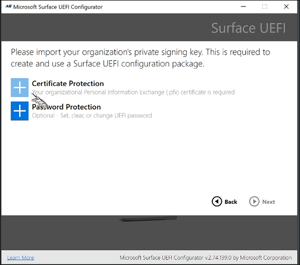
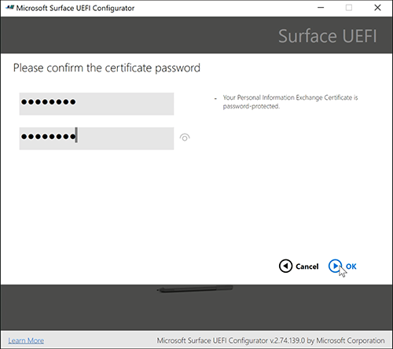
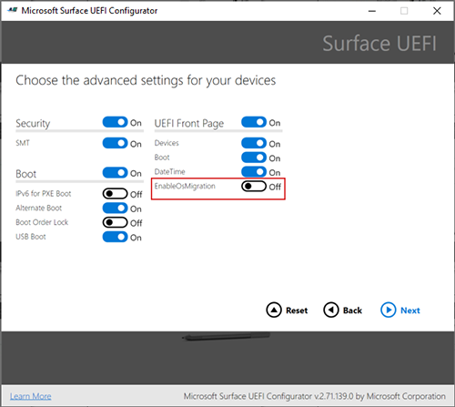
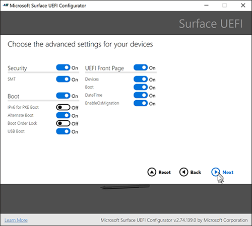
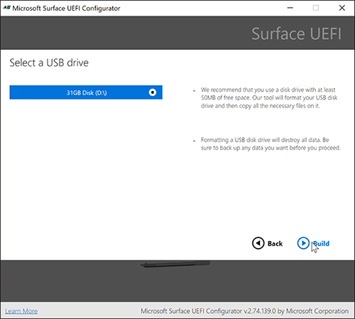
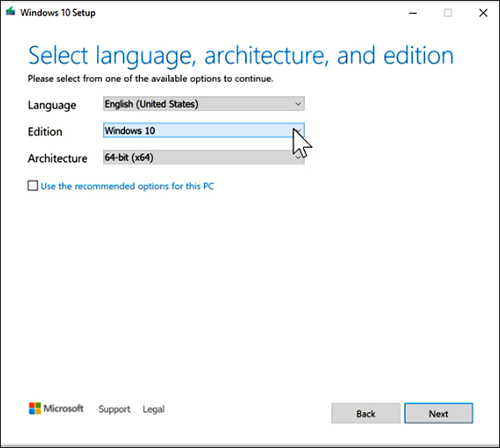
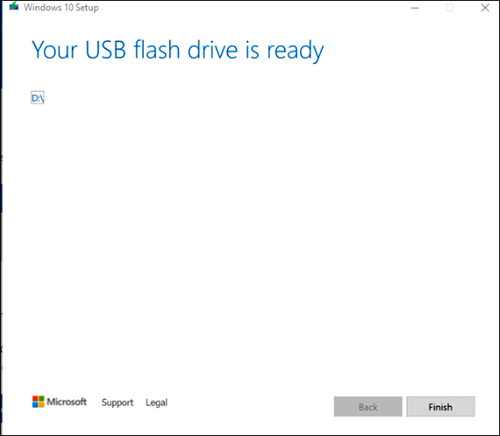
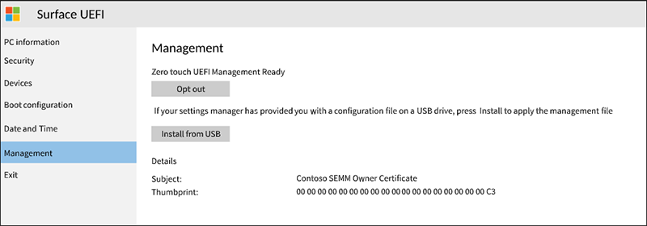
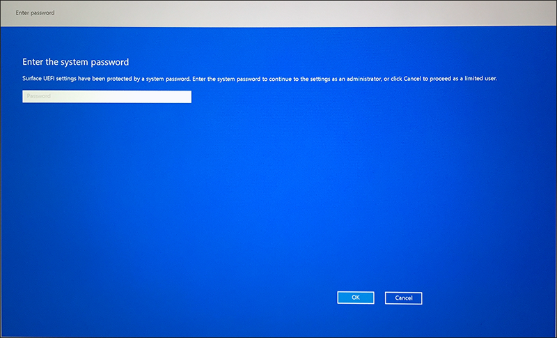
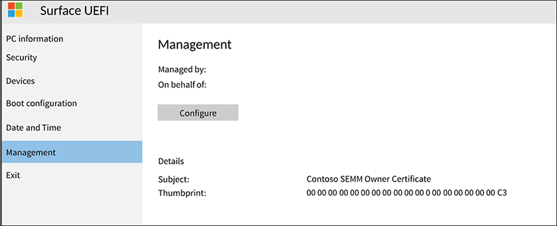

# Migrate to Windows 10 Pro or Enterprise on Surface Hub 2

## Introduction

Surface Hub 2S comes pre-installed with Windows 10 Team, a customized edition of Windows 10 designed to facilitate easy collaboration in meeting room environments. Now you have the option of running Windows 10 Pro or Enterprise to use Surface Hub 2S much like any other PC. 

You start the migration from Windows 10 Team using a separate PC and downloadable tool -- **Surface UEFI Configurator** --  to create a package containing a new UEFI setting that you apply to Surface Hub 2S.  Surface UEFI Configurator functions as an interface into Surface Enterprise Management Mode (SEMM), designed to facilitate centralized management of firmware settings on Surface devices in a corporate environment. To learn more about SEMM, see [Microsoft Surface Enterprise Management Mode documentation](https://docs.microsoft.com/surface/surface-enterprise-management-mode).
 

### Solution Components
- Surface Hub 2S device running Windows 10 Team operating system
- Separate device running Windows 10
- Surface UEFI Configurator tool
- Windows 10 Pro or Enterprise OS image, version 1903 or greater
- Two USB drives with 16GB of storage, FAT32 format
- Surface Hub software & drivers .MSI package
- Internet connection
- Imaging solution (optional)

 
Table 1. Summary workflow

| Step  | Action                                                                                                 | Summary                                                                                                                                                                                                                                                                                                                                                                                                  |
| - | ------------------------------------------------------------------------------------------------------ | -------------------------------------------------------------------------------------------------------------------------------------------------------------------------------------------------------------------------------------------------------------------------------------------------------------------------------------------------------------------------------------------------------- |
| 1 | [Verify UEFI version on Surface Hub 2S meets minimum requirements](#verify-uefi-version-on-surface-hub-2s-meets-minimum-requirements)                                  | Ensure the UEFI version is 694.2938.768.0 or later.                                                                                                                                                                                                                                                                                                                                                      |
| 2 | [Download Surface UEFI Configurator and Surface Hub software & drivers](#download-surface-uefi-configurator-and-surface-hub-software--drivers)                             | Download [Surface UEFI Configurator](https://www.microsoft.com/download/details.aspx?id=46703) from Surface Tools for IT and install it on a separate PC. Download [Surface Hub software & drivers  .MSI package](https://microsoft-my.sharepoint.com/personal/chrislj_microsoft_com/Documents/Poster/Admin_Guide_Working_Folder/Ready%20for%20VTeam%20Review/add%20link) and save it for use in Step 5. |
| 3 | [Prepare SEMM certificate](#prepare-semm-certificate)                                                                          | Prepare required certificate for running Surface UEFI Configurator or use your current certificate.                                                                                                                                                                                                                                                                                                      |
| 4 | [Create SEMM package](#create-semm-package)                                                                               | Launch Surface UEFI Configurator to create a SEMM package on a USB drive which will contain the required configuration files to apply on Surface Hub 2S. Copy these SEMM package  files to a folder on your PC.                                                                                                                                                                                          |
| 5 | [Prepare USB storage containing SEMM package, Windows 10 image, and Surface Hub software & drivers](#prepare-windows-10-usb-flash-drive-with-semm-package-and-surface-hub-software--drivers) | Create a single USB drive (named **BOOTME** in this example) containing a Windows 10 image. Add your Surface Hub software & drivers (Step 2) and SEMM package files (Step 4) to the **BOOTME** drive.                                                                                                                                                                                                  |
| 6 | [Update UEFI on Surface Hub 2S to enable OS migration](#update-uefi-on-surface-hub-2s-to-enable-os-migration)                                              | Use the **BOOTME** drive to boot Surface Hub 2S to the UEFI menu to install SEMM package**.**                                                                                                                                                                                                                                                                                                           |
| 7 | [Install Windows 10 Pro or Enterprise version 1903 or later](#install-windows-10-pro-or-enterprise)                                        | Use the **BOOTME** drive to Install Windows 10 Pro or Enterprise version 1903 and Surface Hub software and drivers MSI.                                                                                                                                                                                                                                                                                 |
| 8 | [Install Surface Hub software & drivers](#install-surface-hub-software--drivers)                                        | To ensure your device has all the latest updates and drivers, install **Surface Hub software & drivers .MSI** file.                                                                                                                                                                                                                                                                                  |

## Verify UEFI version on Surface Hub 2S meets minimum requirements

The minimum UEFI version required prior to migrating the Surface Hub from Windows 10 Team to Windows 10 Desktop is **694.2938.768.0**.
 
**To verify the current UEFI version on your system:**

1. On Surface Hub 2S home screen, select **Start** and open the **Surface** **App** (**All Apps** > **Surface**).
2. Select **Your Surface** to display information about the Surface Hub, including the current version of the UEFI on the device. If the UEFI version is **694.2938.768.0** or later as shown below, the UEFI is eligible for you to create the SEMM package to enable OS migration.  
   
1. If the UEFI version is earlier than version 694.2938.768.0, you will need to obtain a current version using Windows Update.

**To update UEFI from Windows Update:**
1. On your Surface Hub 2S, sign in as an **Admin**, go to **All apps** > **Settings**> **Update and Security** > **Windows Update** and install all updates, then restart the device. Verify the UEFI version using the Surface App. Note: If you do not know your username or admin password, you will need to reset the device. To learn more, see [Reset and recovery for Surface Hub 2S](https://docs.microsoft.com/surface-hub/surface-hub-2s-recover-reset).
2. Repeat these steps until the UEFI version is **694.2938.768.0** or later.
3. If you still do not see the updated UEFI after multiple attempts, check **Update History** and look for any instances of failed firmware installations. You may need to reset your device (**Settings** > **Update & security** > **Reset device**).

## Download Surface UEFI Configurator and Surface Hub software & drivers

On a separate PC:

- Download and install Microsoft [Surface UEFI Configurator](https://www.microsoft.com/download/details.aspx?id=46703) from Surface Tools for IT. (Surface UEFI Configurator cannot be run on Surface Hub 2S, while Windows 10 Team is installed).
- Download Surface Hub software & drivers Windows Installer .MSI package to be applied when installing the new operating system.

## Prepare SEMM certificate

If this is your first time using Surface UEFI Configurator, you’ll need to prepare a certificate. This certificate ensures that after a device is enrolled in SEMM, only packages created with the approved certificate can be used to modify UEFI settings. How you acquire a certificate may vary depending on the size or complexity of your organization:

- Large enterprise organizations typically maintain their own certificate infrastructure to generate certificates per standard security practices.
- Medium-sized businesses and others may choose to obtain a certificate from third party providers. This is the recommended option for organizations without sufficient IT expertise or dedicated IT security team.
- Alternatively, you can generate a self-signed certificate with a PowerShell script per the following documentation: [Surface Enterprise Management Mode certificate requirements](https://docs.microsoft.com/surface/surface-enterprise-management-mode#surface-enterprise-management-mode-certificate-requirements). Or use PowerShell to create your own certificate per the following documentation: [New-SelfSignedCertificate](https://docs.microsoft.com/powershell/module/pkiclient/new-selfsignedcertificate?view=win10-ps).

The SEMM package must be secured with a certificate to verify the signature of configuration files before UEFI settings can be applied. To learn more, see [Surface Enterprise Management Mode](https://docs.microsoft.com/surface/surface-enterprise-management-mode) documentation.
 
 
## Create SEMM package

1. Open **Surface UEFI Configurator** and select **Start**. 
   
1. Select **Surface Devices** and then select **Next**.   
    
  
1. Select **Configuration Package**
    
  
1. Select **Certificate Protection**.  
    

1. You will be prompted to add your certificate .pfx file.    
    
1. Enter your certificate password and select **OK**.   
    

1. Click **Password Protection** to add a password to Surface UEFI. This password will be required whenever you boot to UEFI. It is **strongly recommended** to set a UEFI password you will use on Surface Hub 2S.       
1. Enter your UEFI password.   

> [!NOTE]
> Make a note of your password. If you forget or lose your password, there is no recovery process. 

   
8. Select **Next**.
   
9. Select **Surface Hub 2S** and then select **Next**.
   
10. Select **Next**.
11. To allow installation of Windows 10 Pro or Enterprise, **select **EnableOsMigration.**
   
12. Set **EnableOSMigration** to **On** and select **Next**.
   

> [!NOTE]
> After you apply a SEMM package, all UEFI settings will display as grayed out (locked) in the UEFI menu on the device. This includes default values for other settings such as IPv6 for PXE Boot. To modify UEFI settings, you will need to apply another SEMM package or unenroll the device from SEMM.

### Save SEMM package to USB drive

1. Select the **Hub 2S USB** option and select **Next.**
2. Connect a USB Drive to your PC. Select the USB drive and then select **Build.**
   
   
3. Capture a screenshot of this page and then select **End**. Your SEMM package is now ready and contains the SEMM package **DfciUpdate.dfi** and a text file with the SEMM thumbprint (the last two characters of the certificate’s thumbprint).
   
 4. Save the certificate thumbprint’s last 2 characters, which is required to activate SEMM when you [apply the package](#) on Surface Hub 2S, as shown here:

## Prepare Windows 10 USB flash drive with SEMM package and Surface Hub software & drivers

You can install a Windows 10 Pro or Enterprise image (version 1903 or later) using one of the following options:

- Your current imaging solution
- [Surface Deployment Accelerator](https://docs.microsoft.com/surface/microsoft-surface-deployment-accelerator) lets you create a bootable Windows 10 image which can include all of the current Windows 10 updates, Office, other apps of your choice, as well as the Surface Hub Software and Drivers MSI package.
- USB flash drive with Windows 10 Pro or Enterprise image, followed by installing the Surface Hub software & drivers MSI package.

 
This procedure describes creating a USB flash drive from installation media and then adding the SEMM package files and Surface Hub software & drivers .MSI file. If you’re using other deployment methods, proceed to the following section: [Update UEFI on Surface Hub 2S to enable OS migration](#).

> [!NOTE]
> Once installed, you will need a valid license for Windows 10 Pro or Windows 10 Enterprise.

1. To create a Windows 10 Pro installation, follow the instructions on the [Download Windows 10](https://www.microsoft.com/software-download/windows10) page for using the **Media Creation** tool. To install Windows 10 Enterprise, go to the [Microsoft Volume Licensing Service Center.](https://www.microsoft.com/licensing/servicecenter/default.aspx)
2. Insert a new **USB storage** drive. Launch the **Media Creation** tool, select **Create installation media** and then select **Next**.
   
3. Select language, Windows 10, and 64-bit (x64) and then select **Next**.
   
4. Select **USB flash drive** and select **Next**.
   
5. When the download completes, select **Finish**.
   
6. Copy the SEMM package files and Surface Hub software & drivers .MSI to the USB flash drive (**BOOTME**) containing your Windows 10 image:
    - DfciUpdate.dfi
    - Text file with the SEMM thumbprint. (In this example: SurfaceUEFI_2020Aug25_1058.txt)
    - Surface Hub software & drivers (Surface_Win10_17763_20.053.29802.0.msi)

## Update UEFI on Surface Hub 2S to enable OS migration

Use your **BOOTME** drive to install the SEMM package files and update the UEFI, enabling Surface Hub to run Windows 10 Pro or Enterprise. Then boot from the **BOOTME** drive to install Windows 10.
 

1. Insert your **BOOTME** drive containing SEMM package files, Surface Hub software & drivers .MSI, and Windows 10 install files into the USB-A port on Surface Hub 2S.  
2. To boot into UEFI:
    1. First power off (shutdown) your Surface Hub 2S.
    2. Press and hold **Volume +** and then press and release the **Power** button.
    3. Keep holding **Volume +** until the UEFI menu appears.
	   

3. In the UEFI menu, select **Management** > **Install from USB**.
   
4. When the device restarts, enter the UEFI password you created earlier, if applicable (strongly recommended).
   
5. Enter your two-character **certificate thumbprint**, your **UEFI settings password** and then select **OK**.
     
6. When the UEFI page displays, select **Management** > **Configure**.
   
7. Select **Restart now**, as shown below. The device will shut down.
   

## Install Windows 10 Pro or Enterprise

1. Power on the device. Select **Exit** to restart Surface Hub 2S.
2. To boot directly from the USB drive:
    1. Press **Volume down** and the **Power** button at the same time.
    2. Continue to **press both buttons** until you see the Windows logo.
    3. Release the **Power** button while continuing to press **Volume down** until the installation begins.

3. When the out of box experience (OOBE) setup launches, follow the instructions to install Windows 10 Pro or Enterprise (version 1903 or later).
   

## Install Surface Hub software & drivers

1.	To ensure your device has all the latest updates and drivers, install **Surface Hub software & drivers** .MSI file.

## Next steps

To optimize the use of Surface Hub 2S as a personal productivity device, see [Surface Hub Desktop Post-Install Configuration.](https://docs.microsoft.com/surface-hub/surface-hub-2-post-install)

