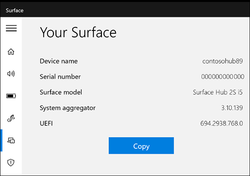
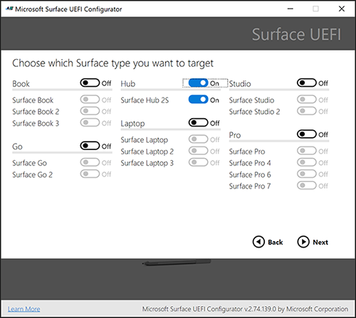
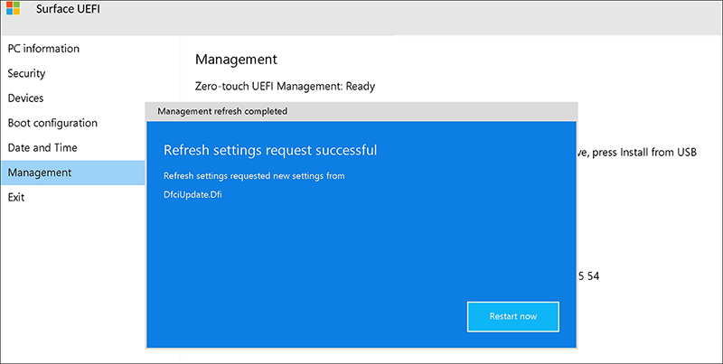
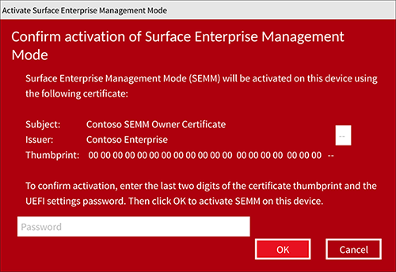

# Migrate to Windows 10 Pro or Enterprise on Surface Hub 2

Surface Hub 2S comes preinstalled with Windows 10 Team. This customized edition of Windows 10 is designed to facilitate collaboration in meeting room environments. Now you have the option of running Windows 10 Pro or Enterprise to use Surface Hub 2S much like any other PC. 

> [!IMPORTANT]
>Unlike a typical upgrade or migration, this process requires you to follow a prescriptive procedure, as described in this article. Review the [Solution components](#solution-components) and [Migration and installation workflow](#migration-and-installation-workflow-summary) before you continue.

> [!NOTE]
> When you install Windows 10 Pro or Enterprise, you need a new licence that's separate from your existing Windows 10 Team license. 

Start the migration from Windows 10 Team by using a separate PC and the downloadable tool *Surface UEFI Configurator*. Use the tool  to create a package that contains a new UEFI setting that you apply to Surface Hub 2S.  

Surface UEFI Configurator works as an interface into Surface Enterprise Management Mode (SEMM). It's designed to facilitate centralized management of firmware settings on Surface devices in a corporate environment. For more information, see the <a href="https://docs.microsoft.com/surface/surface-enterprise-management-mode" target="_blank">Microsoft SEMM documentation</a>
 

## Solution components

- Surface Hub 2S device running the Windows 10 Team operating system
- Separate device running Windows 10
- Surface UEFI Configurator tool to create the SEMM package
- Windows 10 Pro or Enterprise OS image, version 1903 or later
- Two USB drives that have 16 GB of storage, FAT32 format
- The Drivers and Firmware for Windows 10 Pro and Enterprise OS on Surface Hub 2 Microsoft Windows Installer (MSI) file
- Internet connection
- Imaging solution (optional)

 
## Migration and installation workflow summary

| Step  | Action                                                                                                 | Summary                                                                                                                                                                                                                                                                                                                                                                                                  |
| - | ------------------------------------------------------------------------------------------------------ | -------------------------------------------------------------------------------------------------------------------------------------------------------------------------------------------------------------------------------------------------------------------------------------------------------------------------------------------------------------------------------------------------------- |
| 1 | [Verify that the UEFI version on Surface Hub 2S meets minimum requirements.](#verify-uefi-version-on-surface-hub-2s-meets-minimum-requirements)                                  | Ensure the UEFI version is 694.2938.768.0 or later.                                                                                                                                                                                                                                                                                                                                                      |
| 2 | [Download Surface UEFI Configurator and Surface Hub 2 drivers and firmware.](#download-surface-uefi-configurator-and-surface-hub-2-drivers-and-firmware)                             | On the <a href="https://www.microsoft.com/download/details.aspx?id=46703" target="_blank">**Surface Tools for IT** page</a>, select **Download**. Then select and download the **Surface UEFI Configurator .MSI file** and install it on a separate PC. Download the <a href="https://www.microsoft.com/download/details.aspx?id=101974" target="_blank">Drivers and Firmware for Windows 10 Pro and Enterprise OS on Surface Hub 2 MSI file.</a> Save it for use in step 5. |
| 3 | [Prepare SEMM certificate.](#prepare-the-semm-certificate)                                                                          | Prepare the certificate that's required to run Surface UEFI Configurator. Or use your current certificate.                                                                                                                                                                                                                                                                                                      |
| 4 | [Create SEMM package.](#create-a-semm-package)                                                                               | Start Surface UEFI Configurator to create a SEMM package on a USB drive, which will contain the configuration files you need to apply on Surface Hub 2S. Copy these SEMM package files to a folder on your PC.                                                                                                                                                                                          |
| 5 | [Prepare USB flash drive that contains Windows 10 image, SEMM package, and drivers and firmware for Windows 10 Pro and Enterprise OS on Surface Hub 2.](#prepare-a-usb-flash-drive-that-contains-a-windows-10-image-semm-package-and-surface-hub-2-drivers-and-firmware) | Create a single USB drive that contains a Windows 10 image. In this example, the drive is named *BOOTME*. Add your drivers and firmware for Windows 10 Pro and Enterprise OS on Surface Hub 2 (step 2) and SEMM package files (step 4) to the *BOOTME* drive.                                                                                                                                                                                                  |
| 6 | [Update UEFI on Surface Hub 2S to enable OS migration.](#update-uefi-on-surface-hub-2s-to-enable-os-migration)                                              | Use the *BOOTME* drive to boot Surface Hub 2S to the UEFI menu and install the SEMM package.|
| 7 | [Install Windows 10 Pro or Enterprise version 1903 or later.](#install-windows-10-pro-or-enterprise)                                        | Use the *BOOTME* drive to install Windows 10 Pro or Enterprise version 1903 or later.                                                                                                                                                                                                                                                                                 |
| 8 | [Install drivers and firmware for Windows 10 Pro and Enterprise OS on Surface Hub 2.](#install-surface-hub-2-drivers-and-firmware)                                        | To ensure your device has all the latest updates and drivers, install the <a href="https://www.microsoft.com/download/details.aspx?id=101974" target="_blank">Drivers and Firmware for Windows 10 Pro and Enterprise OS on Surface Hub 2 MSI file.</a>                                                                                                                                                                                                                                                                                  |
| 9 | [Fully configure Surface Hub 2S as a personal productivity device.](#configure-recommended-settings)                                        |  Enable recommended settings and applications to optimize Surface Hub 2S as a personal productivity device.                                                                                                                                                                                                                                                                    |

### Verify UEFI version on Surface Hub 2S meets minimum requirements

Before you migrate Surface Hub from Windows 10 Team to Windows 10 Desktop, you need a UEFI version that's at least *694.2938.768.0*.
 
**To verify the UEFI version on your system:**

1. On the Surface Hub 2S home page, select **Start**, and then open the Surface app (**All Apps** > **Surface**).

2. Select **Your Surface** to display information about Surface Hub, including the current UEFI version on the device. 
   - If the UEFI version is *694.2938.768.0* or later, as the following image shows, you can create the SEMM package to enable OS migration.

	   
 
   - If the UEFI version is earlier than version 694.2938.768.0, you will need to obtain a current version by either installing the Window 10 Team 2020 Update Bare Metal Recovery (BMR) image, or by using Windows Update.
   
**To update UEFI via Windows Update:**

1. On your Surface Hub 2S, sign in as **Admin**. 
    >[!Note]
    > If you don't know your username or admin password, you'll need to reset the device. For more information, see <a href="https://docs.microsoft.com/surface-hub/surface-hub-2s-recover-reset" target="_blank">Reset and recovery for Surface Hub 2S.</a>

1. Go to **All apps** > **Settings** > **Update and Security** > **Windows Update**, and then install all updates. 
1. Restart the device. 
1. Verify the UEFI version by using the Surface app. 
1. At this point, if the UEFI version is not yet version  694.2938.768.0 or later, you can either repeat the above steps, or you can get the latest UEFI by installing the Windows 10 Team 2020 Update Bare Metal Recovery (BMR) image.

**To update UEFI via Bare Metal Recovery (BMR) image:**

1.	Go to the [Surface recovery site](https://support.microsoft.com/surfacerecoveryimage) and select **Surface Hub 2S**
3.	Enter your Hub Serial Number (located on the rear side of the Hub next to the power connection.)
4.	Follow the directions to download the image onto a formatted USB drive through installing the Windows 10 Team 2020 Update.
5.	After the update has completed and the device enters the OOBE first time setup, you do not need to complete OOBE, the UEFI version will be updated. Instead power down the device by holding the power button until the screen turns off. 

### Download Surface UEFI Configurator and Surface Hub 2 drivers and firmware

On a separate PC:

1. On the <a href="https://www.microsoft.com/download/details.aspx?id=46703" target="_blank"> Surface Tools for IT page</a>, select **Download**.  
1. Select and download the Surface UEFI Configurator MSI file and install it on a separate PC. The Surface UEFI Configurator tool can't be run on a Surface Hub 2S while the Windows 10 Team edition is installed.

1. Download the <a href="https://www.microsoft.com/download/details.aspx?id=101974" target="_blank">Surface Hub 2 Drivers and Firmware Windows Installer MSI file</a>. You'll use this file when you install the new operating system.

### Prepare the SEMM certificate

If you haven't used Surface UEFI Configurator before, you need to prepare a certificate. This certificate ensures that after a device is enrolled in SEMM, you can modify UEFI settings only by using packages that are created with the approved certificate. 

How you get a certificate depends on the size or complexity of your organization:

- Enterprise organizations typically maintain their own infrastructure to generate certificates according to standard security practices.

- Medium-sized businesses and others might choose to get certificates from partner providers. This option is recommended for organizations that don't have sufficient IT expertise or a dedicated IT security team.

- Alternatively, you can generate a self-signed certificate by using a PowerShell script. For more information, see the <a href="https://docs.microsoft.com/surface/surface-enterprise-management-mode#surface-enterprise-management-mode-certificate-requirements" target="_blank">Surface Enterprise Management Mode certificate requirements </a>. Or you can use PowerShell to create your own certificate. For more information, see the <a href="https://docs.microsoft.com/powershell/module/pkiclient/new-selfsignedcertificate" target="_blank"> New-SelfSignedCertificate</a> documentation.

The SEMM package that Surface UEFI Configurator creates must be secured with a certificate. The certificate verifies the signature of configuration files before UEFI settings can be applied. For more information, see the <a href="https://docs.microsoft.com/surface/surface-enterprise-management-mode" target="_blank"> SEMM documentation</a>.
 
 
### Create a SEMM package

1. On a separate PC, install the Surface UEFI Configurator tool that you downloaded earlier. 

2. Open Surface UEFI Configurator, and then select **Start**.

   
   
3. Select **Surface Devices**, and then select **Next**.

   
  
4. Select **Configuration Package**.

   
  
5. Select **Certificate Protection**.

   

   You're prompted to add your certificate .pfx file.

   
   
7. Enter your certificate password, and then select **OK**.

   

8. Select **Password Protection** to add a password to Surface UEFI. You'll need this password whenever you boot to UEFI. We *strongly recommend* that you set a UEFI password that you'll use on Surface Hub 2S.

   
   
9. Set a UEFI password, and then select **OK**.

   > [!IMPORTANT]
   > Save the password in a secure location that's accessible to your IT admins who manage Surface Hub. If the password is lost, it can't be recovered. 

   

10. Select **Surface Hub 2S**, and then select **Next**.

    
   
11. Select **Next**.

    

12. To allow installation of Windows 10 Pro or Enterprise, turn on **EnableOsMigration**, and then select **Next**.

    
    
    

### Managing SEMM enrollment

Enrolling devices into SEMM affects how you can manage the device going forward. For example, after you apply a SEMM package, in the device's UEFI menu, all UEFI settings are unavailable (locked). Default values for other settings such as **IPv6 for PXE Boot** are also unavailable. 

To change UEFI settings after you finish the migration, apply another SEMM package or unenroll the device from SEMM. If you apply another SEMM package to change the UEFI settings, you must use the original certificate when you build the new SEMM package. Use the UEFI Configurator tool and leave **EnableOSMigration** off (not on, as shown in the original migration steps).

#### Working with partners

If your company is outsourcing the migration to Windows 10 Pro or Enterprise on Surface Hub 2, you may want to have the partner transfer the SEMM certificate, SEMM package, and UEFI password to you.  Alternatively, after migrating the Hub, you can immediately un-enroll it from SEMM, which will allow local administration of UEFI and transfer of the device to another party. Nevertheless, it's still strongly recommended to use a UEFI password, which can be configured after migration. To learn more, see [Manage Surface UEFI settings](https://docs.microsoft.com/surface/manage-surface-uefi-settings). 

#### Save the SEMM package to a USB drive

1. Connect a USB drive to your PC. 
1. Choose **Hub 2S**, and then select **Next**.

   

   > [!WARNING]
   > All existing data on the USB drive is erased when the SEMM package is built. Before building the SEMM package, remove any files from the USB drive that you want to save.
   
2. Select **Build**.

   

3. Capture a screenshot of this page, and then select **End**. Your SEMM package is now ready. It contains the SEMM package *DfciUpdate.dfi* and a text file that includes the SEMM thumbprint (the last two characters of the certificate's thumbprint).

   
   
4. Save the certificate thumbprint's last two characters. You'll need these characters to activate SEMM when you apply the package on Surface Hub 2S.

### Prepare a USB flash drive that contains a Windows 10 image, SEMM package, and Surface Hub 2 drivers and firmware

You can install a Windows 10 Pro or Enterprise image (version 1903 or later) by using one of the following options:

- Your current imaging solution.

- <a href="https://docs.microsoft.com/surface/microsoft-surface-deployment-accelerator" target="_blank"> Surface Deployment Accelerator</a>. Use this tool to create a bootable Windows 10 image. The image can include all current Windows 10 updates, Office, other apps that you choose, and the required drivers and firmware. 

- USB flash drive that contains a Windows 10 Pro or Enterprise image. Then install <a href="https://www.microsoft.com/download/details.aspx?id=101974" target="_blank"> Drivers and Firmware for Windows 10 Pro and Enterprise OS on Surface Hub 2</a>.
 
The following procedure describes how to create a USB flash drive from installation media, and then add the SEMM package files and the Drivers and Firmware for Windows 10 Pro and Enterprise OS on Surface Hub 2 MSI file. If you're using other deployment methods, go to the [Update UEFI on Surface Hub 2S to enable OS migration](#update-uefi-on-surface-hub-2s-to-enable-os-migration) section in this article.

> [!NOTE]
> After you finish the installation, you'll need a valid license for Windows 10 Pro or Windows 10 Enterprise that's separate from your existing Windows 10 Team license.

1. To create a Windows 10 Pro installation, on the<a href="https://www.microsoft.com/software-download/windows10" target="_blank"> Download Windows 10</a> page, follow the instructions to download the media creation tool. To download Windows 10 Enterprise, go to the <a href="https://www.microsoft.com/licensing/servicecenter/default.aspx" target="_blank"> Microsoft Volume Licensing Service Center</a>.

2. Insert a new USB storage drive. 
1. Open the media creation tool, select **Create installation media**, and then select **Next**.

   
   
3. Select a language, and then choose **Windows 10** and **64-bit (x64)**. Then select **Next**.

   
   
4. Select **USB flash drive**, and then select **Next**.

   
   
5. When the download finishes, select **Finish**.

   
   
6. Copy the SEMM package files and the drivers and firmware for Windows 10 Pro and Enterprise OS on Surface Hub 2 (the MSI file) to the root of the USB flash drive (*BOOTME*) that contains your Windows 10 image. The BOOTME USB drive contains:

    - Your Windows 10 bootable image.
    
    - SEMM package files (copied to the root of the USB drive).
    
      - *DfciUpdate.dfi*.
      - Text file that includes the SEMM thumbprint. (In this example, the file is *SurfaceUEFI_2020Aug25_1058.txt*.) The automatically generated date time stamp corresponds to the date that you created the file by using Surface UEFI Configurator.

   - Drivers and firmware for Windows 10 Pro and Enterprise OS on Surface Hub 2 (SurfaceHub2S_Win10_18362_20.082.25682.0.msi). Copy this file to the root of the USB drive.

### Update UEFI on Surface Hub 2S to enable OS migration

1. Insert your BOOTME drive into the USB-A port on Surface Hub 2S. For a list of required files, see the previous section.

2. To boot into UEFI:

   1. Turn off (shut down) your Surface Hub 2S.
   1. Press and hold **Volume +**, and then press and release the power button.
   1. Keep holding **Volume +** until the UEFI menu appears.
   
      
      
3. When the device restarts, enter the UEFI password that you created earlier, if applicable (strongly recommended).

   
   
4. In the UEFI menu, select **Management** > **Install from USB**.

   
   
5. Select **Restart now**, as the following image shows. The device reboots. It displays a white Microsoft logo in the middle of the window and then shuts down.

   
   
6. Press and release the power button. In the red window that appears, activate Surface Enterprise Management Mode. 

7. Enter your two-character certificate thumbprint and your UEFI settings password. Then select **OK**.

   
 
   > [!NOTE]
   > After you activate SEMM on your device, the new UEFI setting **EnableOSMigration** is applied. You'll no longer be able to access Windows 10 Team. Instead, you must continue to the next step and install Windows 10 Pro or Windows 10 Enterprise. 

   The device reboots. It displays the white logo in the middle of the screen and then shuts down again.

### Install Windows 10 Pro or Enterprise

1. If your bootable Windows 10 Pro or Enterprise drive isn't already in the Surface Hub 2 USB-A port, insert it now. Then press and release the power button. 

    When the device starts, you see the white logo in the middle of the screen. Then you see a spinning circle below the white logo.

3. If the device doesn't automatically boot to the USB drive, power off the device (unplug the power cord and then plug it back in). After you plug the power cord in again, the device should boot after a few seconds. Then you'll see the white logo in the middle of screen. 

    If the device doesn't turn on, press and release the power button. Immediately after you see the logo in the middle of the screen, press and hold the volume button until you see the spinning circle below the white logo.
 
   
   
4. When the out-of-box experience (OOBE) setup starts, follow the instructions to install Windows 10 Pro or Enterprise (version 1903 or later).

### Install Surface Hub 2 drivers and firmware

To ensure your device has all the latest updates and drivers, install <a href="https://www.microsoft.com/download/details.aspx?id=101974" target="_blank"> drivers and firmware for Windows 10 Pro and Enterprise OS on Surface Hub 2</a>.
 
## Configure recommended settings

To fully configure Surface Hub 2S as a personal productivity device, see <a href="surface-hub-2-post-install.md" target="_blank">Configure Windows 10 Pro or Enterprise on Surface Hub 2</a>.

> [!NOTE]
>If the steps outlined in this article don't successfully migrate your device to Windows 10 Pro or Enterprise for Surface Hub 2, contact <a href="https://support.microsoft.com/help/4037644/surface-contact-surface-warranty-and-software-support" target="_blank"> Surface Hub Support</a>.

## Roll back to Windows 10 Team

If you want to restore your device to Windows 10 Team, see <a href="surface-hub-2s-recover-reset.md" target="_blank"> Reset and recovery for Surface Hub 2S</a>.

## Version history

The following table summarizes changes to this article.

| Version | Date               | Description                                                                                           |
| ------- | ------------------ | ----------------------------------------------------------------------------------------------------- |
| v. 1.2  | September 29, 2020 | Miscellaneous updates that address usability feedback.                                                        |
| v. 1.1  | September 15, 2020 | Placed an additional note in the introduction that clarifies licensing requirements for installing a new OS. |
| v. 1.0  | September 1, 2020  | New article.                                                                                           |
