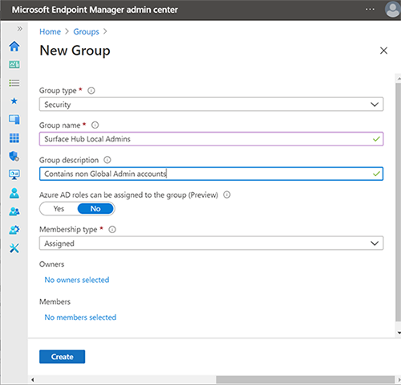
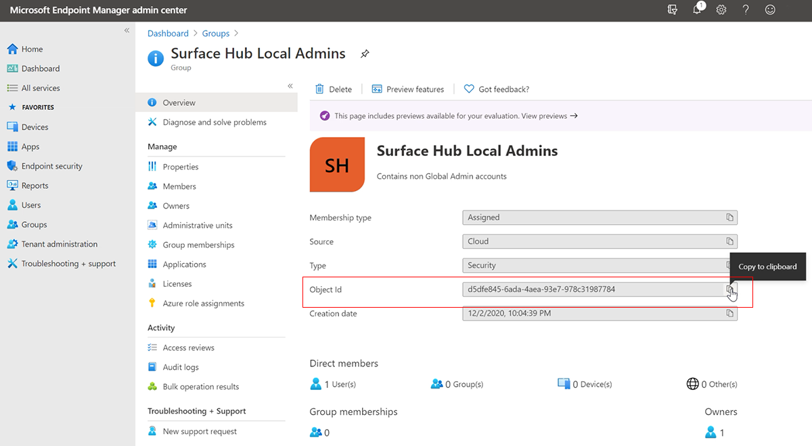
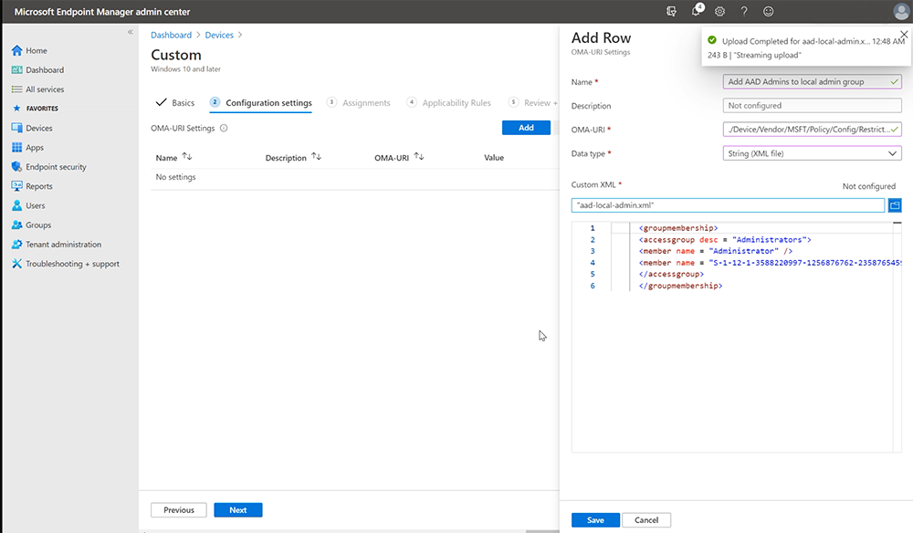

# Configure non Global admin accounts on Surface Hub 2S

When you join Surface Hub 2S to an Azure AD domain, you can configure non Global Admin accounts that limit permissions to the Settings app. 

By default, the admin account for an AAD-joined Hub is set as Global Admin, which also grants admin rights across an entire corporate tenant. 

Before you begin, make sure your Surface Hub is joined to Azure Active Directory. If not, you will need to reset the device and complete OOBE, choosing the option to join Azure AD.

## Summary 

The process of creating non Global admin accounts involves the following steps: 

1. In Microsoft Intune, create a Security group containing the admins designated to manage Surface Hub.
2. Obtain Azure AD Group SID using PowerShell.
3. Create XML file containing Azure AD Group SID.
4. Create a Security Group containing the Surface Hubs that will be managed by the non-Global admins Security group.
5. Create a custom Configuration profile targeting your Surface Hubs security group.


## Create Azure AD security group 

1. Sign into Intune via the [Microsoft Endpoint Manager admin center](https://go.microsoft.com/fwlink/?linkid=2109431), click **Groups** > **New Group** > and under Group type, select **Security.** 
2. Enter a Group name -- for example, **Surface Hub Local Admins** -- and then click **Create.** 

 

3. Open the group, select **Members**, and then choose **Add members** to enter the Administrator accounts that you wish to designate as non Global Admins on Surface Hub. To learn more about creating groups in Intune, see  [Add groups to organize users and devices](https://docs.microsoft.com/mem/intune/fundamentals/groups-add).

## Obtain Azure AD Group SID using PowerShell

1. Launch PowerShell with elevated account privileges (**Run as Administrator**) and ensure your system is configured to run PowerShell scripts. To learn more, refer to [About Execution Policies](https://docs.microsoft.com/powershell/module/microsoft.powershell.core/about/about_execution_policies?). 
2. [Install Azure PowerShell module](https://docs.microsoft.com/powershell/azure/install-az-ps?view=azps-5.1.0).
3. Sign into your Azure AD tenant.
```powershell
Connect-AzureAD
```

4. When you're signed into your tenant, run the following commandlet. It will prompt you to "Please type the Object ID of your Azure AD Group."

```powershell
function Convert-ObjectIdToSid
{    param([String] $ObjectId)   
     $d=[UInt32[]]::new(4);[Buffer]::BlockCopy([Guid]::Parse($ObjectId).ToByteArray(),0,$d,0,16);"S-1-12-1-$d".Replace(' ','-')
	 
}
```

5. In Intune, select the group you created earlier and copy the Object id, as shown in the following figure. 

 

6. Run the following commandlet to get the security group's SID:
```powershell
$AADGroup = Read-Host "Please type the Object ID of your Azure AD Group"
$Result = Convert-ObjectIdToSid $AADGroup
Write-Host "Your Azure Ad Group SID is" -ForegroundColor Yellow $Result
```

7. Paste the Object id into the PowerShell commandlet, press **Enter**, and then copy the **Azure AD Group SID** into a text editor. 

## Create XML file containing Azure AD Group SID

1. Copy the following into a text editor: 

```xml
      <groupmembership>   
	  <accessgroup desc = "Administrators">        
	  <member name = "Administrator" />        
	  <member name = "S-1-12-1-XXXXXXXXXX-XXXXXXXXXX-XXXXXXXXXX-XXXXXXXXXX" />  
	  </accessgroup>
	  </groupmembership>
  ```

2. Replace the placeholder SID (beginning with S-1-12-1) with your **Azure AD Group SID** and then save the file as XML; for example, **aad-local-admin.xml**. 

## Create Custom configuration profile

1. In Endpoint Manager, click **Devices** > **Configuration profiles** > **Create profile**. 
2. Under Platform select **Windows 10 and later.** Under Profile, select **Custom**, and then click **Create.**
3. Add a name and description and then click **Next.**
4. Under **Configuration settings** > **OMA-URI Settings**, click **Add**.
5. In the Add Row pane, add a name and under     **OMA-URI**, add the following  string: 

```OMA-URI
./Device/Vendor/MSFT/Policy/Config/RestrictedGroups/ConfigureGroupMembership
```
6. Under Data type, select **String XML** and browse to open the XML file you created in the previous step. 

 

7. Click **Save**.
8. Click **Select groups to include** and choose the group you created earlier (**Surface Hub Local Admins**). Click **Next.**
9. Under Applicability rules, add a Rule if desired. Otherwise, click **Next** and then click **Create**.

To learn more about custom configuration profiles using OMA-URI strings, see [Use custom settings for Windows 10 devices in Intune](https://docs.microsoft.com/mem/intune/configuration/custom-settings-windows-10)


## Non Global admins managing Surface Hub

Members of the **Surface Hub Local Admins** Security group can now sign in to the Settings app on Surface Hub and manage settings.
