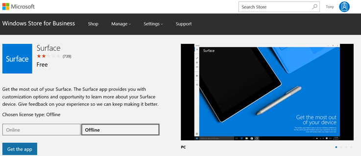
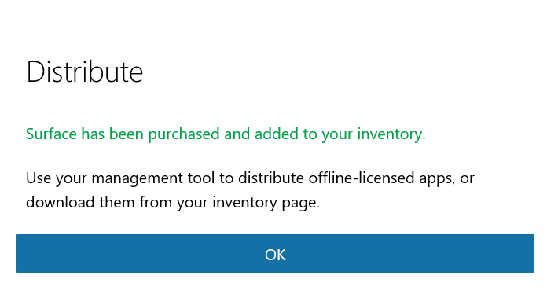
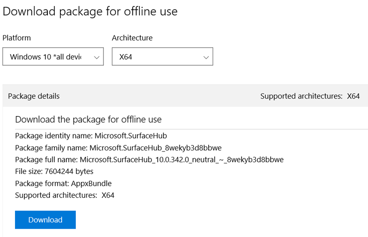

# Deploy Surface app with Microsoft Store for Business and Education

**Applies to**

- Surface Laptop Go
- Surface Pro 7
- Surface Laptop 3
- Surface Pro 6
- Surface Laptop 2
- Surface Go
- Surface Go with LTE
- Surface Book 2
- Surface Pro with LTE Advanced (Model 1807)
- Surface Pro (Model 1796)
- Surface Laptop
- Surface Studio
- Surface Studio 2
- Surface Book
- Surface Pro 4
- Surface 3 LTE
- Surface 3
- Surface Pro 3


The Surface app is a lightweight Microsoft Store app that provides control of many Surface-specific settings and options, including: 

* Enable or disable the Windows button on the Surface device 

* Adjust the sensitivity of a Surface Pen 

* Customize Surface Pen button actions 

* Enable or disable Surface audio enhancements 

* Quick access to support documentation and information for your device

Customers using Windows Update will ordinarily receive Surface app as part of automatic updates. But if your organization is preparing images for deployment to your Surface devices, you may want to include the Surface app (formerly called the Surface Hub) in your imaging and deployment process instead of requiring users of each individual device to download and install the app from the Microsoft Store or your Microsoft Store for Business. 

> [!NOTE]
> This article does not apply to Surface Pro X. For more information, refer to [Deploying, managing, and servicing Surface Pro X](surface-pro-arm-app-management.md)

## Surface app overview

The Surface app is available as a free download from the [Microsoft Store](https://www.microsoft.com/store/apps/Surface/9WZDNCRFJB8P). Users can download and install it from the Microsoft Store, but if your organization uses Microsoft Store for Business instead, you will need to add it to your store’s inventory and possibly include the app as part of your Windows deployment process. These processes are discussed throughout this article. For more information about Microsoft Store for Business, see [Microsoft Store for Business](https://docs.microsoft.com/microsoft-store/) in the Windows TechCenter. 

## Add Surface app to a Microsoft Store for Business account 

Before users can install or deploy an app from a company’s Microsoft Store for Business account, the desired app(s) must first be made available and licensed to the users of a business. 

1. If you have not already done so, create a [Microsoft Store for Business account](https://www.microsoft.com/business-store). 

2. Log on to the portal. 

3. Enable offline licensing: click **Manage->Store settings**, and then select the **Show offline licensed apps to people shopping in the store** checkbox, as shown in Figure 1. For more information about Microsoft Store for Business app licensing models, see [Apps in Microsoft Store for Business and Education](https://docs.microsoft.com/microsoft-store/).

   > [!div class="mx-imgBorder"]
   > <br/>
   *Figure 1. Enable apps for offline use*

4. Add Surface app to your Microsoft Store for Business account by following this procedure:

    * Click the **Shop** menu.
    
    * In the search box, type **Surface app**, and then click the search icon.
    
    * After the Surface app is presented in the search results, click the app’s icon.
    
    * You are presented with a choice (select **Online** or **Offline**), as shown in Figure 2.
    
      > [!div class="mx-imgBorder"]
      >    
      *Figure 2. Select the Offline licensing mode and add the app to your inventory*
    
    * Click **Offline** to select the Offline licensing mode.
    
    * Click **Get the app** to add the app to your Microsoft Store for Business inventory. As shown in Figure 3, you’ll see a dialog box that prompts you to acknowledge that offline apps can be deployed using a management tool or downloaded from the company’s inventory page in their private store.
    
      > [!div class="mx-imgBorder"]
      > 
      *Figure 3. Offline-licensed app acknowledgement*
      
    * Click **OK**.

## Download Surface app from a Microsoft Store for Business account
After you add an app to the Microsoft Store for Business account in Offline mode, you can download and add the app as an AppxBundle to a deployment share.

1. Log on to the Microsoft Store for Business account at https://businessstore.microsoft.com.

2. Click **Manage->Apps & software**. A list of all of your company’s apps is displayed, including the Surface app you added in the [Add Surface app to a Microsoft Store for Business account](#add-surface-app-to-a-microsoft-store-for-business-account) section of this article.

3. Under **Actions**, click the ellipsis (**…**), and then click **Download for offline use** for the Surface app.

4. Select the desired **Platform** and **Architecture** options from the available selections for the selected app, as shown in Figure 4.

    > [!div class="mx-imgBorder"]
    > <br/>
    *Figure 4. Download the AppxBundle package for an app*
    
5. Click **Download**. The AppxBundle package will be downloaded. Make sure you note the path of the downloaded file because you’ll need that later in this article.

6. Click either the **Encoded license** or **Unencoded license** option. Use the Encoded license option with management tools like Microsoft Endpoint Configuration Manager or when you use Windows Configuration Designer to create a provisioning package. Select the Unencoded license option when you use Deployment Image Servicing and Management (DISM) or deployment solutions based on imaging, including the Microsoft Deployment Toolkit (MDT).

7. Click **Generate** to generate and download the license for the app. Make sure you note the path of the license file because you’ll need that later in this article.

>[!NOTE]
>When you download an app for offline use, such as the Surface app, you may notice a section at the bottom of the page labeled **Required frameworks**. Your target computers must have the frameworks installed for the app to run, so you may need to repeat the download process for each of the required frameworks for your architecture (either x86 or x64) and also include them as part of your Windows deployment discussed later in this article.

Figure 5 shows the required frameworks for the Surface app.

> [!div class="mx-imgBorder"]
> <br/>
*Figure 5. Required frameworks for the Surface app*

>[!NOTE]
>The version numbers of the Surface app and required frameworks will change as the apps are updated. Check for the latest version of Surface app and each framework in Microsoft Store for Business. Always use the Surface app and recommended framework versions as provided by Microsoft Store for Business. Using outdated frameworks or the incorrect versions may result in errors or application crashes.

To download the required frameworks for the Surface app, follow these steps:

1. Click the **Download** button under **Microsoft.VCLibs.140.00_14.0.23816.0_x64__8wekyb3d8bbwe**. This downloads the Microsoft.VCLibs.140.00_14.0.23816.0_x64__8wekyb3d8bbwe.Appx file to your specified folder.

2. Click the **Download** button under **Microsoft.NET.Native.Runtime.1.1_1.1.23406.0_x64__8wekyb3d8bbwe**. This downloads the Microsoft.NET.Native.Runtime.1.1_1.1.23406.0_x64__8wekyb3d8bbwe.Appx file to your specified folder.

>[!NOTE]
>Only the 64-bit (x64) version of each framework is required for Surface devices. Surface devices are native 64-bit UEFI devices and are not compatible with 32-bit (x86) versions of Windows that would require 32-bit frameworks. 

## Install Surface app on your computer with PowerShell
The following procedure provisions the Surface app onto your computer and makes it available for any user accounts created on the computer afterwards.

1. Using the procedure described in the [How to download Surface app from a Microsoft Store for Business account](#download-surface-app-from-a-microsoft-store-for-business-account) section of this article, download the Surface app AppxBundle and license file. 

2. Begin an elevated PowerShell session.

    >[!NOTE]
    >If you don’t run PowerShell as an Administrator, the session won’t have the required permissions to install the app.
    
3. In the elevated PowerShell session, copy and paste the following command:

    ```powershell
    Add-AppxProvisionedPackage –Online –PackagePath <DownloadPath>\ Microsoft.SurfaceHub_10.0.342.0_neutral_~_8wekyb3d8bbwe.AppxBundle –LicensePath <DownloadPath>\ Microsoft.SurfaceHub_8wekyb3d8bbwe_a53ef8ab-9dbd-dec1-46c5-7b664d4dd003.xml
    ```

    Where `<DownloadPath>` is the folder where you downloaded the AppxBundle and license file from the Microsoft Store for Business account.

    For example, if you downloaded the files to c:\Temp, the command you run is:
    
    ````powershell
    Add-AppxProvisionedPackage –Online –PackagePath c:\Temp\ Microsoft.SurfaceHub_10.0.342.0_neutral_~_8wekyb3d8bbwe.AppxBundle –LicensePath c:\Temp\ Microsoft.SurfaceHub_8wekyb3d8bbwe_a53ef8ab-9dbd-dec1-46c5-7b664d4dd003.xml
    ```

4. The Surface app will now be available on your current Windows computer. 

   Before the Surface app is functional on the computer where it has been provisioned, you must also provision the frameworks described earlier in this article. To provision these frameworks, use the following procedure in the elevated PowerShell session you used to provision the Surface app.

5. In the elevated PowerShell session, copy and paste the following command:

   ```powershell
   Add-AppxProvisionedPackage –Online –SkipLicense –PackagePath <DownloadPath>\Microsoft.VCLibs.140.00_14.0.23816.0_x64__8wekyb3d8bbwe.Appx
   ```
   
6. In the elevated PowerShell session, copy and paste the following command:

   ```powershell
   Add-AppxProvisionedPackage –Online –SkipLicense –PackagePath <DownloadPath>\Microsoft.NET.Native.Runtime.1.1_1.1.23406.0_x64__8wekyb3d8bbwe.Appx
   ```

## Install Surface app with MDT
The following procedure uses MDT to automate installation of the Surface app at the time of deployment. The application is provisioned automatically by MDT during deployment and thus you can use this process with existing images. This is the recommended process to deploy the Surface app as part of a Windows deployment to Surface devices because it does not reduce the cross platform compatibility of the Windows image.

1. Using the procedure described [earlier in this article](#download-surface-app-from-a-microsoft-store-for-business-account), download the Surface app AppxBundle and license file. 

2. Using the New Application Wizard in the MDT Deployment Workbench, import the downloaded files as a new **Application with source files**.

3. On the **Command Details** page of the New Application Wizard, specify the default **Working Directory** and for the **Command** specify the file name of the AppxBundle, as follows:

   * Command:
   
     ```console
     Microsoft.SurfaceHub_10.0.342.0_neutral_~_8wekyb3d8bbwe.AppxBundle
     ```
     
   * Working Directory: %DEPLOYROOT%\Applications\SurfaceApp

For the Surface app to function on the target computer, it will also require the frameworks described earlier in this article. Use the following procedure to import the frameworks required for the Surface app into MDT and to configure them as dependencies.

1. Using the procedure described earlier in this article, download the framework files. Store each framework in a separate folder.

2. Using the New Application Wizard in the MDT Deployment Workbench, import the downloaded files as a new **Application with source files**.

3. On the **Command Details** page, type the file name of each application you downloaded in the **Command** field and the default Working Directory.

To configure the frameworks as dependencies of the Surface app, use this process:

1. Open the properties of the Surface app in the MDT Deployment Workbench.

2. Click the **Dependencies** tab, and then click **Add**.

3. Select the check box for each framework using the name you provided in the New Application Wizard.

After import, the Surface app will be available for selection in the **Applications** step of the Windows Deployment Wizard. You can also install the application automatically by specifying the application in the deployment task sequence by following this process:

1. Open your deployment task sequence in the MDT Deployment Workbench.

2. Add a new **Install Application** task in the **State Restore** section of deployment.

3. Select **Install a single application** and specify the **Surface App** as the **Application to be installed**.

For more information about including apps into your Windows deployments, see [Deploy Windows 10 with the Microsoft Deployment Toolkit](https://technet.microsoft.com/itpro/windows/deploy/deploy-windows-10-with-the-microsoft-deployment-toolkit).
