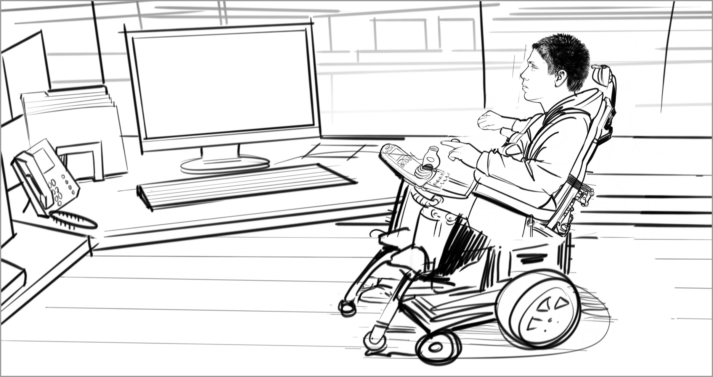
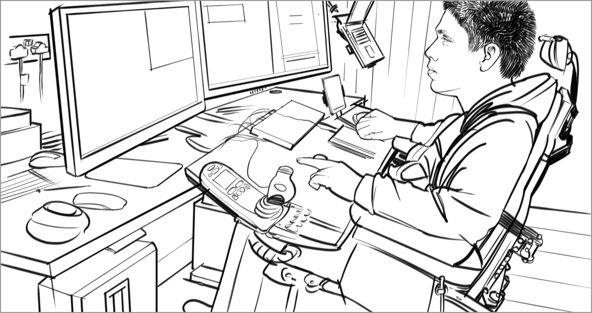

# Muscle tone

**The tightness or looseness of muscles that ultimately impact strength, range of motion, coordination, and speed.**

Muscle tone can affect the use of an arm or hand when using a device. It varies from person to person. Muscle tone is often described as “spastic” and tight or “flaccid” and floppy/loose. Often, muscle tightness results in joints being constricted into bent positions, such as hands being closed into a fist position or arms and elbows being flexed inward.

When muscles are too tight, hands and arms are unable to stretch open and perform normal movement. Conversely, if muscles are too loose and lack tension, there may be weakness that affects normal motion, or it may be impossible to move the arm at all. While someone with rigid and tight arm muscles may be unable to straighten their arm to use a mouse on a desktop, they may be able to use a pen on a tablet that is brought close to their body. Tone is one of the many factors that ultimately affects strength, coordination, and range of motion.

Variations in muscle tone are very common and can be caused by neurological conditions like Parkinson’s and cerebral palsy, a stroke, head or spinal cord injuries which impact nerves, nerve injuries themselves, or injuries to the arm and hand.

## Barriers
* Experiences that require physical contact or movement in order to complete tasks (such as typing, using a mouse, and holding a pen)​
* Hardware that must be physically manipulated (such as opening a lid, inserting charging cords, and pressing buttons)​

## Facilitators
* Support for alternate input controls (such as dictation, voice commands, or other accessible input hardware)​
* Hardware designs that facilitate ease of use (such as larger buttons, lightweight opening mechanisms, etc.)​

## Examples

BARRIER — Desktop computers and keyboards require the ability to sit upright and maintain outstretched arms to type and move a mouse.

FACILITATOR — Products that support alternative input methods help create a workstation where controls are within reach and can be adapted or reconfigured as needed.

[comment]: # (Footer statement)
___
The purpose of this reference is to provide concepts people can use to document and discuss aspects of function. Design should happen with people with disabilities, this reference is meant to support that activity, not replace it. 