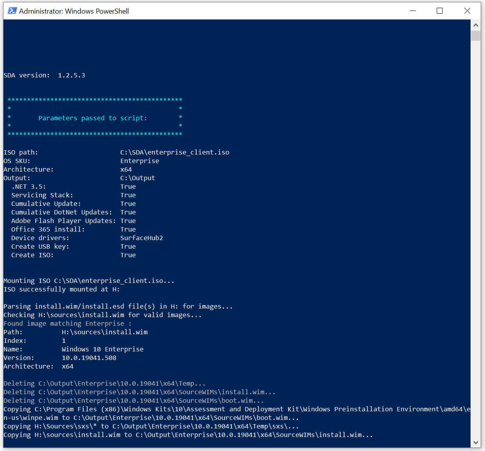

# Microsoft Surface Deployment Accelerator

Microsoft Surface Deployment Accelerator (SDA) automates the creation and configuration of a Microsoft recommended deployment experience by using free Microsoft deployment tools.

Redesigned in April 2020 to simplify and automate deployment of Surface images in a corporate environment, the 
SDA tool allows you to build a “factory-like” Windows image that you can customize to your organizational requirements.

The open source, script-driven SDA tool leverages the Windows Assessment and Deployment Kit (ADK) for Windows 10, facilitating the creation of Windows images (WIM) in test or production environments. If the latest ADK is not already installed, it will be downloaded and installed when running the SDA tool.

The resulting image closely matches the configuration of Bare Metal Recovery (BMR) images, without any pre-installed applications such as Microsoft Office or the Surface UWP application.

## Requirements

1. A USB thumb drive at least 16 GB in size. The USB drive will be formatted.
2. An .iso file with Windows 10 Pro or Windows 10 Enterprise. The media creation tool can be used to download Windows 10 and create an .iso file. For more information, see [Download Windows 10](https://www.microsoft.com/software-download/windows10).

## How to run SDA

**To run SDA:**

1. Go to [SurfaceDeploymentAccelerator](https://github.com/microsoft/SurfaceDeploymentAccelerator) on GitHub. 
2. Review the [README](https://github.com/microsoft/SurfaceDeploymentAccelerator/blob/master/README.md) documentation.
3. On the [SurfaceDeploymentAccelerator](https://github.com/microsoft/SurfaceDeploymentAccelerator) page, click the **Code** button and then select **Download ZIP** to save the files locally on your computer.
4. Right-click the .zip file and then click **Properties**.
5. On the **General** tab, select the **Unblock** checkbox and then click **OK**.
6. Extract the .zip file to a location on your hard drive (ex: C:\SDA).
7. Open an elevated Windows PowerShell prompt and set ExecutionPolicy for the current session to Unrestricted.

    ```powershell
    Set-ExecutionPolicy -Scope Process -ExecutionPolicy Unrestricted -Force
    ```
8. Run the SDA script specifying parameters for your environment. For example, the following command will create a bootable USB drive that can be used to install Windows 10 on a Surface Hub 2:

    ```powershell
    .\CreateSurfaceWindowsImage.ps1 -ISO C:\SDA\enterprise_client.iso -OSSKU Enterprise -DestinationFolder C:\Output -Device SurfaceHub2 -CreateUSB $True
    ```

   

    The script will require about 45 minutes to run, but could take longer depending on available CPU and disk resources. 

    After creating a Windows image, the script will ask you to confirm the drive letter of your USB drive. The USB drive will then be formatted, configured as bootable, and files copied to enable installation of the custom Windows 10 image for Surface devices.

9. Insert the USB drive into the device where you want to install Windows 10 and reboot to begin installing Windows 10. USB boot must be enabled in BIOS, which can require that you temporarily disable Secure Boot.

> [!IMPORTANT]
> Booting from the USB drive will immediately begin installing Windows 10. Ensure that your device is ready before inserting the USB and restarting. 

## Related links

 - [Open source image deployment tool released on GitHub](https://techcommunity.microsoft.com/t5/surface-it-pro-blog/open-source-image-deployment-tool-released-on-github/ba-p/1314115)

 - [Download and install the Windows ADK](https://docs.microsoft.com/windows-hardware/get-started/adk-install)
