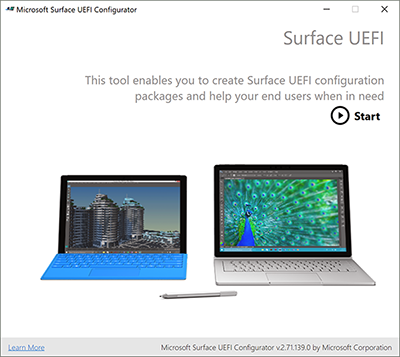
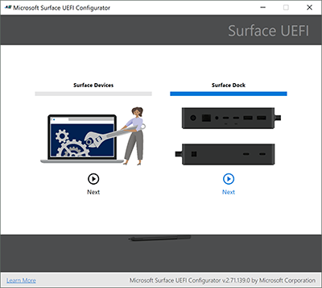
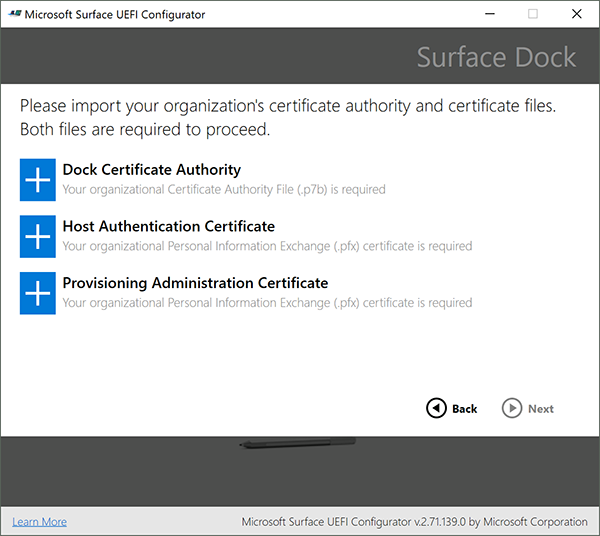
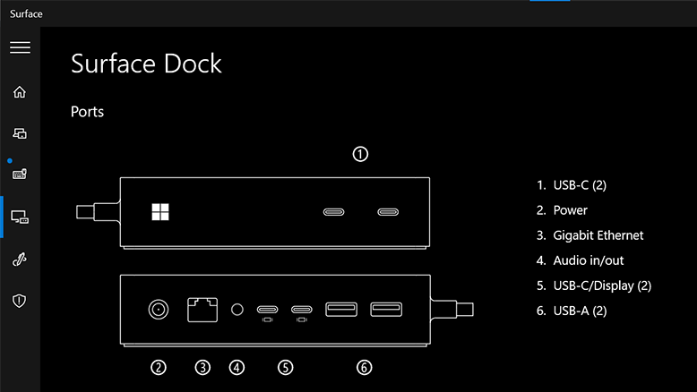
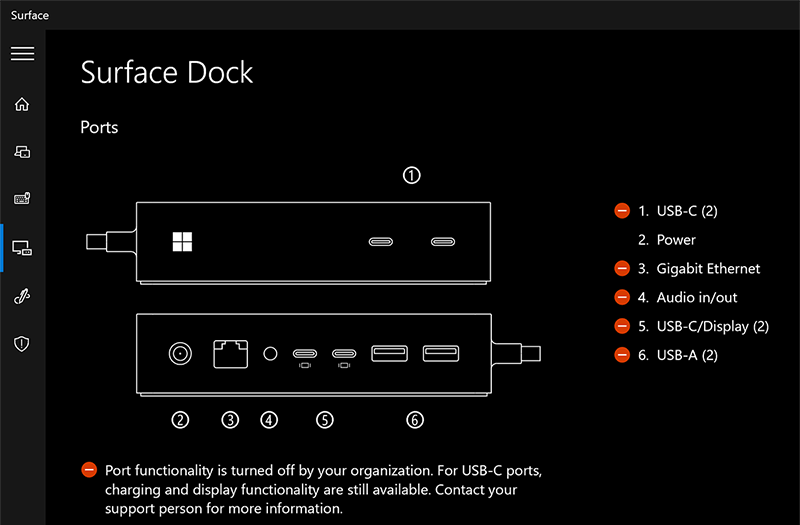

# Secure Surface Dock 2 ports with Surface Enterprise Management Mode (SEMM)

## Introduction

Surface Enterprise Management Mode (SEMM) enables IT admins to secure and manage Surface Dock 2 ports by configuring UEFI settings in a Windows installer configuration package (.MSI file) deployed to compatible Surface devices across a corporate environment.

### Supported devices

Managing Surface Dock 2 with SEMM is available for docks connected to Surface Book 3, Surface Laptop 3, and Surface Pro 7. These compatible Surface devices are commonly referred to as **host devices**. A package is applied to host devices based on if a host device is **authenticated** or **unauthenticated**. Configured settings reside in the UEFI layer on host devices enabling you — the IT admin — to manage Surface Dock 2 just like any other built-in peripheral such as the camera.

>[!NOTE]
>You can manage Surface Dock 2 ports only when the dock is connected to one of the following compatible devices:  Surface Book 3, Surface Laptop 3, and Surface Pro 7. Any device that doesn't receive the UEFI Authenticated policy settings is inherently an unauthenticated device.

Restricting Surface Dock 2 to authorized persons signed into a corporate host device provides another layer of data protection. This ability to lock down Surface Dock 2 is critical for specific customers in highly secure environments who want the functionality and productivity benefits of the dock while maintaining compliance with strict security protocols. We anticipate SEMM used with Surface Dock 2 will be particularly useful in open offices and shared spaces especially for customers who want to lock USB ports for security reasons.

## Configuring and deploying UEFI settings for Surface Dock 2

This section provides step-by-step guidance for the following tasks:

1. Install **Surface UEFI Configurator**.
1. Create or obtain public key certificates.
1. Create an .MSI configuration package.
   1. Add your certificates.
   1. Enter the 16-digit RN number for your Surface Dock 2 devices.
   1. Configure UEFI settings.
1. Build and apply the configuration package to targeted Surface devices (Surface Book 3, Surface Laptop 3, or Surface Pro 7.)

>[!NOTE]
>The **Random Number (RN)** is a unique 16-digit hex code identifier which is provisioned at the factory, and printed in small type on the underside of the dock. The RN differs from most serial numbers in that it can't be read electronically. This ensures proof of ownership is primarily established only by reading the RN when physically accessing the device. The RN may also be obtained during the purchase transaction and is recorded in Microsoft inventory systems.

### Install SEMM and Surface UEFI Configurator

Install SEMM by running **SurfaceUEFI_Configurator_v2.71.139.0.msi**. This is a standalone installer and contains everything you need to create and distribute configuration packages for Surface Dock 2.

- Download **Surface UEFI Configurator** from [Surface Tools for IT](https://www.microsoft.com/en-us/download/details.aspx?id=46703).

## Create public key certificates

This section provides specifications for creating the certificates needed to manage ports for Surface Dock 2.

### Prerequisites

This article assumes that you either obtain certificates from a third-party provider or you already have expertise in PKI certificate services and know how to create your own.  You should be familiar with and follow the general recommendations for creating certificates as described in [Surface Enterprise Management Mode (SEMM)](https://docs.microsoft.com/surface/surface-enterprise-management-mode) documentation, with one exception. The certificates documented on this page require expiration terms of 30 years for the **Dock Certificate Authority**, and 20 years for the **Host Authentication Certificate**.

For more information, see [Certificate Services Architecture](https://docs.microsoft.com/windows/win32/seccrypto/certificate-services-architecture) documentation and review the appropriate chapters in [Windows Server 2019 Inside Out](https://www.microsoftpressstore.com/store/windows-server-2019-inside-out-9780135492277), or [Windows Server 2008 PKI and Certificate Security](https://www.microsoftpressstore.com/store/windows-server-2008-pki-and-certificate-security-9780735640788) available from Microsoft Press.

### Root and host certificate requirements

Prior to creating the configuration package, you need to prepare public key certificates that authenticate ownership of Surface Dock 2 and facilitate any subsequent changes in ownership during the device lifecycle. The host and provisioning certificates require entering EKU IDs otherwise known as **Client Authentication Enhanced Key Usage (EKU) object identifiers (OIDs)**.

The required EKU values are listed in Table 1 and Table 2.

#### Table 1. Root and Dock Certificate requirements

|Certificate|Algorithm|Description|Expiration|EKU OID|
|---|---|---|---|---|
|Root Certificate Authority|ECDSA_P384|- Root certificate with 384-bit prime elliptic curve digital signature algorithm (ECDSA) - SHA 256 Key Usage: CERT_DIGITAL_SIGNATURE_KEY_USAGE - CERT_KEY_CERT_SIGN_KEY_USAGE CERT_CRL_SIGN_KEY_USAGE|30 years|N/A
|Dock Certificate Authority|ECC P256 curve|- Host certificate with 256-bit elliptic-curve cryptography (ECC) - SHA 256 Key Usage: CERT_KEY_CERT_SIGN_KEY_USAGE - Path Length Constraint = 0|20 years|1.3.6.1.4.1.311.76.9.21.2 1.3.6.1.4.1.311.76.9.21.3|

   >[!NOTE]
   >The dock CA must be exported as a .p7b file.

### Provisioning Administration Certificate requirements

Each host device must have the doc CA and two certificates as shown in Table 2.

#### Table 2. Provisioning administration certificate requirements

|Certificate|Algorithm|Description|EKU OID|
|---|---|---|---|
|Host authentication certificate|ECC P256 SHA 256|Proves the identity of the host device.|1.3.6.1.4.1.311.76.9.21.2|
|Provisioning administration certificate|ECC P256 SHA256|Enables you to change dock ownership and/or policy settings by allowing you to replace the CA that's currently installed on the dock.|1.3.6.1.4.1.311.76.9.21.3 1.3.6.1.4.1.311.76.9.21.4|

   >[!NOTE]
   >The host authentication and provisioning certificates must be exported as.pfx files.

### Create configuration package

When you have obtained or created the certificates, you’re ready to build the MSI configuration package that will be applied to target Surface devices.

1. Run Surface **UEFI Configurator**.

   

1. Select **Surface Dock**.

   

1. On the certificate page, enter the appropriate **certificates**.

   

1. Add appropriate dock RNs to the list.

   >[!NOTE]
   >When creating a configuration package for multiple Surface Dock 2 devices, instead of entering each RN manually, you can use a .csv file that contains a list of RNs.

1. Specify your policy settings for USB data, Ethernet, and Audio ports. UEFI Configurator lets you configure policy settings for authenticated users (Authenticated Policy) and unauthenticated users (Unauthenticated Policy). The following figure shows port access turned on for authenticated users and turned off for unauthenticated users.

   

   - Authenticated user refers to a Surface Device that has the appropriate certificates installed, as configured in the .MSI configuration package that you applied to target devices. It applies to any user authenticated user who signs into the device. 
   - Unauthenticated user refers to any other device.
   - Select **Reset** to create a special “Reset” package that will remove any previous configuration package that the dock had accepted.

1. Select **Build** to create the package as specified.

### Apply the configuration package to a Surface Dock 2

1. Take the MSI file that the Surface UEFI Configurator generated and install it on a Surface host device. Compatible host devices are Surface Book 3, Surface Laptop 3, or Surface Pro 7.
1. Connect the host device to the Surface Dock 2. When you connect the dock UEFI policy settings are applied.

## Verify managed state using the Surface App

Once you have applied the configuration package, you can quickly verify the resultant policy state of the dock directly from the Surface App, installed by default on all Surface devices. If Surface App isn't present on the device, you can download and install it from the Microsoft Store.

### Test scenario

Objective: Configure policy settings to allow port access by authenticated users only.

1. Turn on all ports for authenticated users and turn them off for unauthenticated users.

   

1. Apply the configuration package to your target device and then connect Surface Dock 2.

1. Open **Surface App** and select **Surface Dock** to view the resultant policy state of your Surface Dock. If the policy settings are applied, Surface App will indicate that ports are available.

   

1. Now you need to verify that the policy settings have successfully turned off all ports for unauthenticated users. Connect Surface Dock 2 to an unmanaged device, i.e., any Surface device outside the scope of management for the configuration package you created.

1. Open **Surface App** and select **Surface Dock**. The resultant policy state will indicate ports are turned off.

   

>[!NOTE]
>If you want to keep ownership of the device, but allow all users full access, you can make a new package with everything turned on. If you wish to completely remove the restrictions and ownership of the device (make it unmanaged), select **Reset** in Surface UEFI Configurator to create a package to apply to target devices.

Congratulations. You have successfully managed Surface Dock 2 ports on targeted host devices.

## Learn more

- [Surface Enterprise Management Mode (SEMM) documentation](https://docs.microsoft.com/surface/surface-enterprise-management-mode)
- [Certificate Services Architecture](https://docs.microsoft.com/windows/win32/seccrypto/certificate-services-architecture)
- [Windows Server 2019 Inside Out](https://www.microsoftpressstore.com/store/windows-server-2019-inside-out-9780135492277)
- [Windows Server 2008 PKI and Certificate Security](https://www.microsoftpressstore.com/store/windows-server-2008-pki-and-certificate-security-9780735640788)
