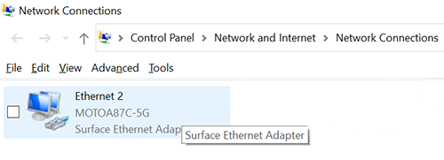
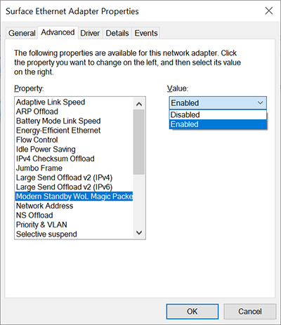

# Wake On LAN for Surface devices

To keep devices fully up to date, IT admins need to be able to wake up devices when they’re not in use, typically during nightly maintenance windows. Surface devices that use a Surface Ethernet adapter to connect to a wired network can take advantage of Wake on LAN (WOL). With WOL, IT admins can remotely wake up devices and automatically perform management tasks with Microsoft Intune or other mobile device management (MDM) providers.

## How it works

When not in use, Surface devices enter an idle, low powered state known as Modern Standby or Connected Standby. IT admins can remotely trigger devices using a wake request (magic packet) that contains the Media Access Control (MAC) address of the target Surface device. The destination network interface card (NIC) compares the MAC address with its own before waking up the device. If the MAC address in the magic packet wake request does not match the MAC address on the destination NIC, the NIC won’t wake up the device.

Many management solutions, such as Microsoft Endpoint Configuration Manager and third-party Microsoft Store apps provide built-in support for WOL. To learn more about waking devices with Endpoint Configuration Manager, see [Configure Wake on LAN - Configuration Manager](https://docs.microsoft.com/mem/configmgr/core/clients/deploy/configure-wake-on-lan).

## Requirements

**Connected Standby:** [Compatible Surface devices](#compatible-surface-devices) must:

- Be connected to AC power
- Have a compatible Ethernet NIC connected to either a USB port on the device or Surface Dock or Surface Dock 2.

**Hibernation (S4 power state)**:  [Compatible Surface devices](#compatible-surface-devices) must:

- Be connected to AC power
- Have Wake on LAN UEFI policy setting enabled via SEMM. (Not required for devices connected to Surface Dock 2.)

 **Hibernation (S5 “soft off” power state)**: [Compatible Surface devices](#compatible-surface-devices)  must:

- Be connected to AC power
- Be connected to Surface Dock 2.

### Wake on LAN UEFI policy setting

To wake devices from Hibernation using a USB Ethernet adapter, requires enabling the Wake on LAN UEFI setting using [Surface Enterprise Management Mode](surface-enterprise-management-mode.md) (SEMM).

**To enable:**

1. Download and install **Surface UEFI Configurator**.
2. Select **Start** > **Configuration Package** > **Create** >**+ Certificate Protection**.
3. Go to **Advanced settings** and switch **Wake on LAN** to **On**.

    > [!div class="mx-imgBorder"]
    >  

## Compatible Surface devices

Support for Wake on LAN varies depending on the sleep state of the device (Connected Standby or Hibernation) as well as the type of processor installed on the device.  

### Connected Standby

By default, Windows 10 supports Wake on LAN for Surface devices in Connected Standby mode. Supported Surface devices include:

- Surface Laptop 3 (Intel processors only).
- Surface Laptop 4 (Intel processors only).
- Surface Pro 7.
- Surface Pro 7+
- Surface Pro X
- Surface Go 2
- Surface Laptop Go
- Surface Book 3

### Hibernation for standalone devices

Wake on LAN for devices in hibernation mode is supported for most newer standalone Surface devices with some exceptions. Waking standalone devices out of hibernation requires enablling Wake on LAN using SEMM, as described above.

 Supported devices include:

- Surface Laptop 3 (Intel processors only).
- Surface Laptop 4 (Intel processors only).
- Surface Pro 7.
- Surface Pro 7+
- Surface Laptop Go
- Surface Book 3

## Hibernation for devices connected to Surface Dock 2

Surface Dock 2 adds support for S4 (Hibernation) as well as the S5 “soft off” state to the following devices (in addition to the devices listed in the previous section).

- Surface Go 2
- Surface Pro X
- Surface Laptop 4 (AMD processors)

To learn more about power states, see [System Power States](https://docs.microsoft.com/windows/win32/power/system-power-states).

## Supported Ethernet NICs

- Surface USB 3.0 Gigabit Ethernet Adapter
- Surface Ethernet Adapter
- Surface USB-C to Ethernet and USB Adapter
- Microsoft USB-C Travel Hub
- Surface Dock
- Surface Dock 2

### To check WOL is enabled on your device

1. On your Ethernet connected device, select your network adapter, and then select **Properties**.

   > [!div class="mx-imgBorder"]
   > 

2. Select **Configure** > **Advanced**.
3. Scroll to **Modern Standby WoL Magic Packet** and ensure **Enabled** is selected.

    > [!div class="mx-imgBorder"]
    > 

## Learn more

- [Surface Dock 2](https://www.microsoft.com/p/surface-dock-2-for-business/8q4hgc6kbmdq?)
- [Microsoft Surface USB-C to Ethernet and USB Adapter](https://www.microsoft.com/p/surface-usb-c-to-ethernet-and-usb-adapter/8wt81cglrblp?)
- [Surface USB 3.0 Gigabit Ethernet Adapter](https://www.microsoft.com/p/surface-usb-30-gigabit-ethernet-adapter/8xn9fqvzbvq0?)
